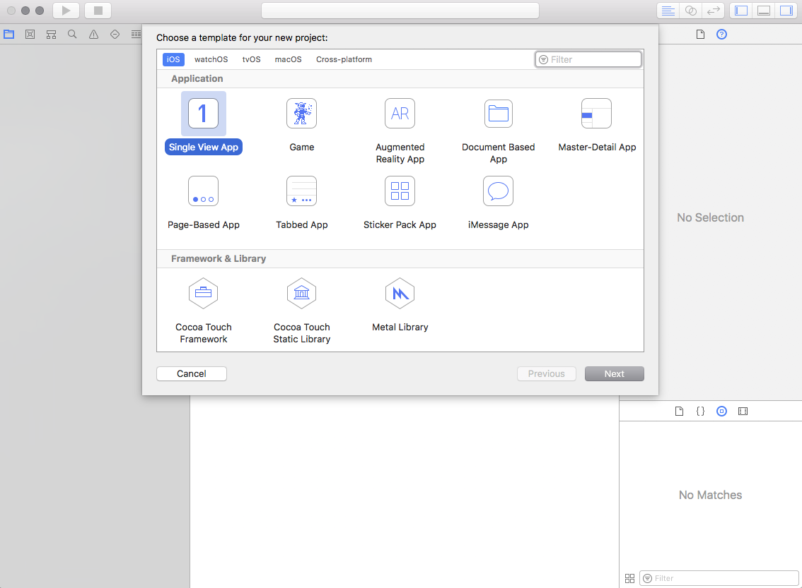
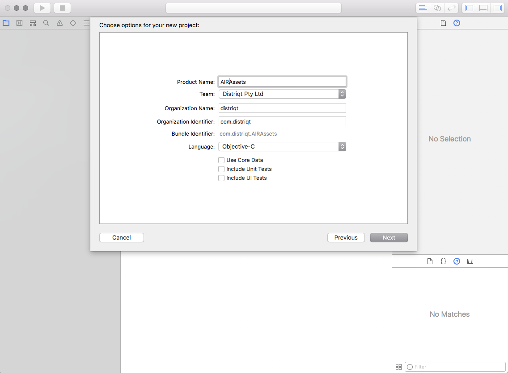
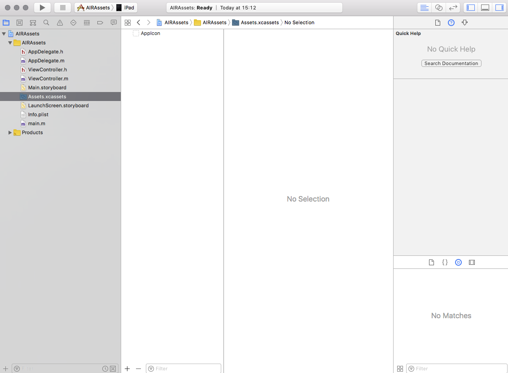
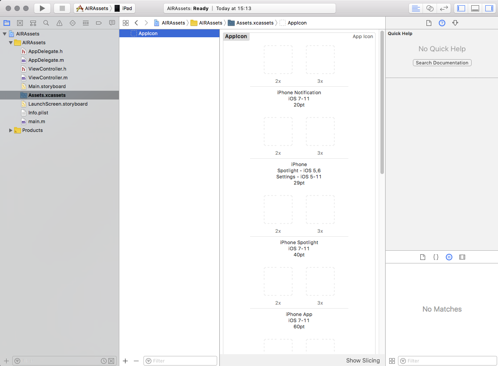
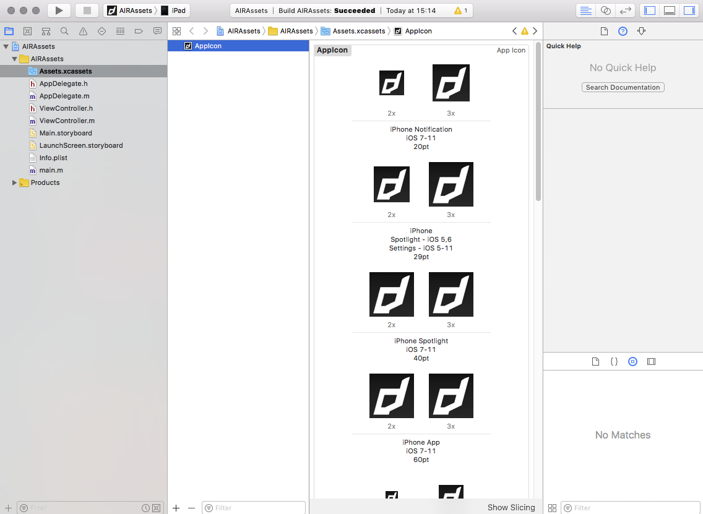

From iOS 11 Apple now requires a new process of adding icons to your application, you can no longer simply package them as you have done with previous versions of iOS and AIR. Instead you need to create an asset catalog (`Assets.car` file) and package in the root directory of your application.

>
> Note: The `Assets.car` file is needed for iOS 11+ when you are using AIR SDK v28+
>

Additionallyu from iOS 13 Apple now requires a new process of adding launch / splash screens to your application, you can no longer simply package the "default.png" images in your application you have done with previous versions of iOS and AIR. 

>
> Note: Apple will soon enforce launch screens with the iOS 13 requirement so this will be a prerequisite for publishing in the AppStore
>


Contents:
- [Method 1: Command Line](#method-1-air-imagescripts)
- [Method 2: Using Xcode](#method-2-using-xcode)
- [Method 3: Online Tool](#method-3-online-tool)
- [Packaging Asset Catalog](#packaging-asset-catalog)
- [Simple Launch Screen](#simple-launch-screen)
- [Supporting previous versions of iOS](#supporting-previous-versions-of-ios)


## Creating the Asset Catalogue


### Method 1: AIR-ImageScripts

:::tip Recommended Approach
You will need a macOS machine with Xcode and imagemagik for this method, however the files can be transferred afterwards. 
:::

This is the method we prefer as it is simpler to update and create than having to drag files into Xcode. We have a script that downloads the required assets, resizes an icon and launch screen image appropriately and calls the xcode utilities to generate the Assets.car (and launch screen).

The script is available in the [AIR-ImageScripts repository](https://github.com/distriqt/AIR-ImageScripts) 

You will need to have installed `imagemagick` and the **xcode command line utilities** (see details in the repository if you need help installing them).

To use it you will need to create 4 files for your icon. We require a foreground and background for your main icon so we can correctly create the adaptive icons for various situations. Then also a monochrome version of your foreground icon for themed environments and then a complete alternative icon to be used in dark situations on iOS. 

These four base images are used to construct the icons for each of the platforms:

- `icon-foreground.png`: should be a transparent icon with no background which will be layered over the background and centered on the launch image
- `icon-background.png`: should be a filled image which constitutes the background of adaptive icons and the launch image (generally a solid colour)
- `icon-monochrome.png`: similar to the foreground icon except this should be monochrome and will be tinted by the OS to colour match the user's theme
- `icon-dark.png`: a specific dark image to be used as the dark icon on iOS

All of these files should be high resolution (we suggest 1024x1024) 

Next create a `launch.png` launch screen image (we suggest a large 2732x2732 pixel image). 

Place all these files in a directory and open a terminal at this location. You can either clone the repository and use the `generateIcons` script directly or call it as below:

```
/bin/bash -c "$(curl -fsSL https://github.com/distriqt/AIR-ImageScripts/releases/download/v2.0/generateIcons)"
```

Once complete this will have generated an `out` directory that contains 

- `Assets.car` your asset catalogue 
- `LaunchScreen.storyboardc` directory is your custom launch screen storyboard
- `icons` directory containing icon images sized for AIR
- `res` folder containing adaptive icons for Android

Copy these into your application as you require.

You can use the `icons` directory in your application descriptor by adding the following:

```xml
<icon>
    <image16x16>icons/icon16x16.png</image16x16>
    <image29x29>icons/icon29x29.png</image29x29>
    <image32x32>icons/icon32x32.png</image32x32>
    <image36x36>icons/icon36x36.png</image36x36>
    <image40x40>icons/icon40x40.png</image40x40>
    <image48x48>icons/icon48x48.png</image48x48>
    <image57x57>icons/icon57x57.png</image57x57>
    <image58x58>icons/icon58x58.png</image58x58>
    <image60x60>icons/icon60x60.png</image60x60>
    <image72x72>icons/icon72x72.png</image72x72>
    <image76x76>icons/icon76x76.png</image76x76>
    <image80x80>icons/icon80x80.png</image80x80>
    <image87x87>icons/icon87x87.png</image87x87>
    <image114x114>icons/icon114x114.png</image114x114>
    <image120x120>icons/icon120x120.png</image120x120>
    <image128x128>icons/icon128x128.png</image128x128>
    <image144x144>icons/icon144x144.png</image144x144>
    <image152x152>icons/icon152x152.png</image152x152>
    <image167x167>icons/icon167x167.png</image167x167>
    <image180x180>icons/icon180x180.png</image180x180>
    <image512x512>icons/icon512x512.png</image512x512>
    <image1024x1024>icons/icon1024x1024.png</image1024x1024>
</icon>
```

### Method 2: Using Xcode

:::note
You will need a macOS machine with Xcode for this method to generate the `Assets.car` file
:::

Firstly you will need to open Xcode and create a new application

- Start a new project and select the "Single View App" under the iOS section (or tvOS section if you are creating this file for a tvOS application).



- Fill Product Name, Organization Name and Organization Identifier (no specific names required).



- Save the project 
- In the left hand panel select the `Assets.xcassets` file



- Select the `AppIcon`




- Add all the required versions of the AppIcon




- Build the project ( Product -> Build).
- Right-click on your ‘.app’ -> Show in finder.
- Right click on your ‘.app’ -> Show package contents.
- Now copy `Assets.car` and package with AIR application.


>
> **If you want to include a launch storyboard see [here](ios-launchscreens).**
>


### Method 3: Online tool

:::caution
We do not recommend this approach as it can cause issues depending on your AIR developer license. This approach can miss resources required by the AIR SDK and cause your application to crash. 
:::

This is the simplest way if you are a Windows developer. 

Simply go to the following url:

[http://applicationloader.net/appuploader/icontool.php](http://applicationloader.net/appuploader/icontool.php)

and upload a 1024x1024 image of your icon. You will get a zip download containing the `Assets.car` file and all the icon sizes needed to embed in your iOS application. 

Using this method you will not be able to add the LaunchImage so you will have to add a story board manually. 


## Packaging Asset Catalog

The `Assets.car` file must be placed at the root of your application, this means alongside your `swf` and other application content. 

You do this by ensuring that it is in the root of your applications source and selected as a single file in your application package.


## Simple Launch Screen

To simplify migration to launch storyboards we have created a simple storyboard that pulls an image from your `Assets.car` and aspect fills it to the screen. You will add a single image to your `Assets.car` alongside your application icons. 

The AIR Image Scripts process above should have generated this launch screen for you.


Download this zip file and extract the `LaunchScreen.storyboardc`. Add it to your application and ensure it is packaged at the root level of your application alongside your `Assets.car`. 

- [LaunchScreen.storyboardc.zip](resources/ios/LaunchScreen.storyboardc.zip)

:::note
`LaunchScreen.storyboardc` is a directory but will appear as a "file" (package) on macOS
:::

Add the following to the `InfoAdditions` node in your application descriptor:

```xml
<key>UILaunchStoryboardName</key>
<string>LaunchScreen</string>
```

That is all, you have now implemented a launch storyboard.


## Launch images

:::note
This is no longer relevant as the minimum iOS version supported by new apps should support the launch screen approach and the default images are no longer required.
:::

Recently Apple changed the supported names of the files for the default / launch images. Make sure you have correctly added the default images according to the Adobe docs:

[http://blogs.adobe.com/airodynamics/2015/03/09/launch-images-on-ios-with-adobe-air/](http://blogs.adobe.com/airodynamics/2015/03/09/launch-images-on-ios-with-adobe-air/)


### Supporting previous versions of iOS


You must also make sure that you include the icons in your application using the icon tags in the application descriptor xml. 
This ensures that older versions of iOS still have the correct icons packaged and that other platforms still have the appropriate app icons.


