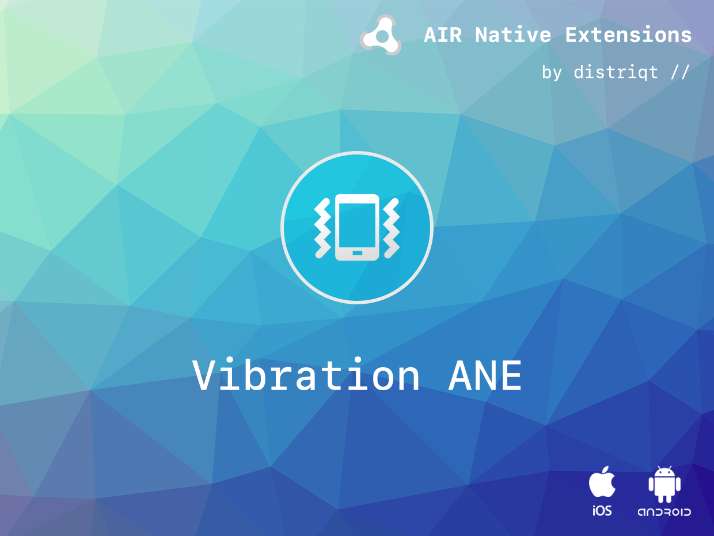

# Vibration

The [Vibration](https://airnativeextensions.com/extension/com.distriqt.Vibration) extension 
provides access to a device's native vibration capabilities. 
It also gives you the ability to provide haptic feedback to your users using the native haptic feedback process.


### Features

- Vibrate: Provides access to native vibration functionality
- Provide haptic feedback using the native haptic feedback process
- Single API: Works across iOS and Android with the same code
- Sample project code and ASDocs reference


The simple API allows you to quickly integrate vibration in your AIR application. 
Identical code base can be used across all platforms allowing you to concentrate on 
your application and not device specifics.

We provide complete guides to get you up and running with the extension quickly and easily.

As with all our extensions you get access to a year of support and updates as we are continually 
improving and updating the extensions for OS updates and feature requests.


## Documentation


The [wiki](https://github.com/distriqt/ANE-Vibration/wiki) forms the best source of detailed documentation for the extension along with the [asdocs](https://docs.airnativeextensions.com/asdocs/vibration). 


Quick Example:

```actionscript
if (Vibration.isSupported)
{
	Vibration.service.vibrate();
}
```

More information here: 

[com.distriqt.Vibration](https://airnativeextensions.com/extension/com.distriqt.Vibration)


## License

You can purchase a license for using this extension:

[airnativeextensions.com](https://airnativeextensions.com/)

distriqt retains all copyright.


