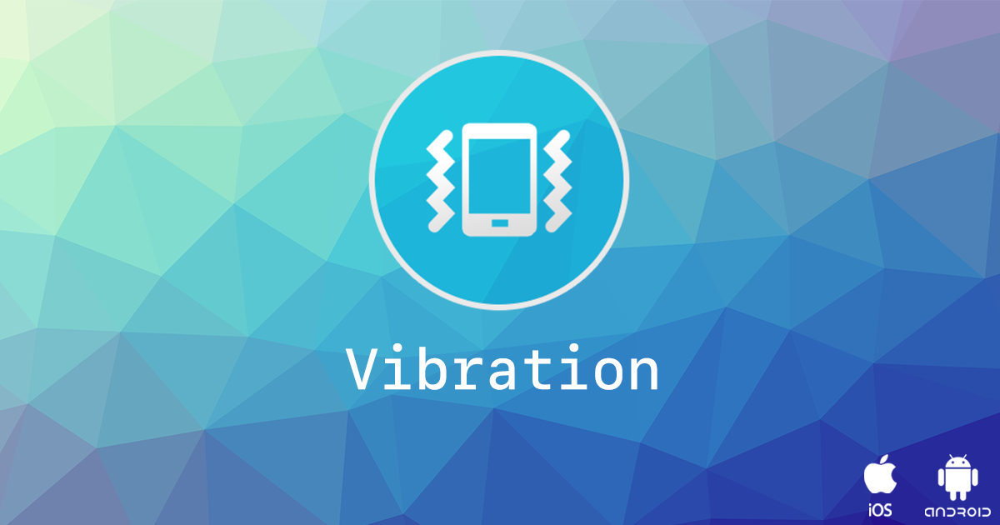
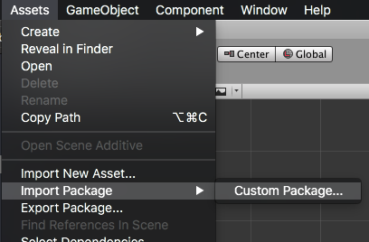

<!--newpage-->


## Contents

- [Overview](#overview)
- [Features](#features)
- [Add the Plugin](#add-the-plugin)
    - [Asset Store](#asset-store)
    - [Manual Installation](#manual-installation)
    - [Import the Plugin](#import-the-plugin)
- Usage
    - [Vibrate](#vibrate)
    - [Feedback Generators](#feedback-generators)
    - [Haptic Engine](#haptic-engine)
- [Support](#support)


<!--newpage-->


## Overview

The [Vibration](https://airnativeextensions.com/extension/com.distriqt.Vibration) extension provides access to a device's native vibration capabilities. 
It also gives you the ability to provide haptic feedback to your users using the native haptic feedback process, and access to the haptic engine on iOS to provide highly customised feedback.


### Features

- Vibrate: Provides access to native vibration functionality;
- Provide haptic feedback using the native haptic feedback process;
- Access the advanced haptic engine to create customised haptic feedback; 
- Single API: Works across iOS and Android with the same code;
- Sample project code and ASDocs reference;


The simple API allows you to quickly integrate vibration in your AIR or Unity application. 
Identical code base can be used across supported platforms allowing you to concentrate on your application and not device specifics.

We provide complete guides to get you up and running with the extension quickly and easily.

As with all our extensions you get access to a year of support and updates as we are continually improving and updating the extensions for OS updates and feature requests.


### Documentation

The [documentation site](https://docs.airnativeextensions.com/docs/vibration/) forms the best source of detailed documentation for the extension along with the [asdocs](https://docs.airnativeextensions.com/asdocs/vibration/). 


Quick Example:

```csharp 
if (Vibration.isSupported)
{
	Vibration.Instance.Vibrate();
}
```


<!--newpage-->


## Add the Plugin

First step is always to add the plugin to your development environment. 


### Asset Store

Open the Asset Store in your browser and add the Share plugin to your assets.

Open the Package Manager (Window > Package Manager) in the Unity Editor and select the "My Assets" section. Select the Share plugin, and click Import in the bottom right.


### Manual Installation

In unity you import the package by selecting `Assets / Import Package / Custom Package ...` and then browsing to the unity plugin package file: `com.distriqt.Vibration.unitypackage`.



You can manually download the extension from our repository:

- https://github.com/distriqt/ANE-Vibration


### Import the Plugin


This will present the import dialog and display all the files for the plugin, make sure all the files are selected.

The plugin will be added to your project and you can now use the plugins functionality in your application.


### Proguard 

If you are using a custom proguard configuration you may need to add the following line to ensure the interface class for the plugin is accessible to unity at runtime.

```
-keep class com.distriqt.extension.vibration.VibrationUnityPlugin {*;}
```


<!--newpage-->


## Checking for Support

You can use the `isSupported` flag to determine if this extension is supported on the current platform and device.

This allows you to react to whether the functionality is available on the device and provide an alternative solution if not.


```csharp
if (Vibration.isSupported)
{
	// Functionality here
}
```


<!--newpage-->


## Vibrate

To make the device vibrate is a simple matter of calling the `vibrate` function.

```csharp 
Vibration.Instance.Vibrate();
```

### Android 

On Android you have access to more control over the length and pattern of the vibration.

You can control the length of the vibration by passing the first parameter to the 
`vibrate` function. This parameter specifies the length of the vibration in milliseconds.

For example, vibrate for 1 second: 

```csharp 
Vibration.Instance.Vibrate(1000);
```

You can set vibration patterns to control the length and gap between vibrations.
For example, the following sets a vibrate pattern on for 200 milliseconds then off for 500 twice:

```csharp 
Vibration.Instance.Vibrate( 0, new long[] {0, 200, 500, 200, 500} );
```


The last parameter allows you to repeat the pattern, x number of times. 
The default `-1` will no repeat, and `0` will repeat indefinitely. 

The following example will vibrate with the pattern, continuously (until cancel is called)

```csharp 
Vibration.Instance.Vibrate( 0, new long[] {0, 200, 500, 200, 500}, 0 );
```


### Cancel 

You can cancel an active vibration by calling `cancel`:

```csharp 
Vibration.Instance.Cancel();
```


### iOS 

On iOS all the parameters to `vibrate` are ignored and the function will 
produce exactly 0.4 seconds of vibration and 0.1 seconds of silence.


<!--newpage-->

## Feedback Generators


Haptic feedback provides a tactile response, such as a tap, that draws attention and reinforces both actions and events. While many system-provided interface elements (for example, pickers, switches, and sliders) automatically provide haptic feedback, you can use feedback generators to add your own feedback to custom views and controls.

When providing feedback:

- Always use feedback for its intended purpose. Don’t select a haptic because of the way it feels.
- The source of the feedback must be clear to the user. For example, the feedback must match a visual change in the user interface, or must be in response to a user action. Feedback should never come as a surprise.
- Don’t overuse feedback. Overuse can cause confusion and diminish the feedback’s significance.


### Create a Feedback Generator

To create a feedback generator you call the `createFeedbackGenerator()` function and specify the type of the feedback this generator will be used for. This function will return an instance of a `FeedbackGenerator` which you can then use to perform feedback.

For example, to create an impact feedback generator:

```csharp 
FeedbackGenerator generator 
    = Vibration.Instance.CreateFeedbackGenerator( 
            FeedbackGeneratorType.IMPACT
        );
```


### Perform Feedback

Once you have created your generator, performing feedback is a simple matter of calling the `performFeedback` function:

```csharp 
generator.PerformFeedback();
```

>
> Note: calling these methods does not play haptics directly. Instead, it informs the system of the event.
> The system then determines whether to play the haptics based on the device, the application’s state, the amount of battery power remaining, and other factors.
>
> On Android this will additionally depend on whether the user has disabled haptic feedback in the device settings.
>


### Prepare

If you are attempting to time the feedback more precisely, for example, to align with sounds, you should use the `prepare` function a short time before requiring feedback to ensure the hardware is in a state ready to provide feedback. 

This is currently mainly required on iOS, however it is intended to perform the same operation on Android so you should use it in the same places on all platfroms.

##### iOS Documentation

> 
> When you call this method, the generator is placed into a prepared state for a short period of time. While the generator is prepared, you can trigger feedback with lower latency.
>
> Think about when you can best prepare your generators. Call prepare() before the event that triggers feedback. The system needs time to prepare the Taptic Engine for minimal latency. Calling prepare() and then immediately triggering feedback (without any time in between) does not improve latency.
> 
> To conserve power, the Taptic Engine returns to an idle state after any of the following events:
> - You trigger feedback on the generator.
> - A short period of time passes (typically seconds).
> - The generator is deallocated.
> 
> After feedback is triggered, the Taptic Engine returns to its idle state. If you might trigger additional feedback within the next few seconds, immediately call prepare() to keep the Taptic Engine in the prepared state.
> 
> You can also extend the prepared state by repeatedly calling the prepare() method. However, if you continue calling prepare() without ever triggering feedback, the system may eventually place the Taptic Engine back in an idle state and ignore any further prepare() calls until after you trigger feedback at least once.
> 
> 


To prepare your generator simply call the `prepare()` function:

```csharp 
generator.Prepare();
```


<!--newpage-->

## Haptic Engine 

Compose and play haptic patterns to customize your app’s feedback.

Use haptics to engage users physically, with tactile feedback that gets attention and reinforces actions.

Your app can play custom haptic patterns crafted from basic building blocks called haptic events (`HapticEvent`). Events can be transient, like the feedback you get from toggling a switch, or continuous, like the vibration or sound from a ringtone. You can use transient and continuous patterns independently, or build your pattern from precise combinations of the two. 


### Support

You should check whether the current device supports the haptic engine by checking the `isSupported` property on the `HapticEngine` instance.

```csharp 
if (Vibration.Instance.HapticEngine.IsSupported)
{
    // Haptic Engine is supported
}
```

If it is not supported you should fall back to other feedback methods, such as simple vibrations.


>
>   Haptic Engine is only supported on iOS currently
>

### Create a player

To create a player call the `createAdvancedPlayer()` method passing in your pattern and initial params.

>
> Currently the parameters to this method including the pattern are ignored. 
> A haptic player with a single continuous pattern containing intensity and sharpness parameters will be created.
>  

```csharp 
HapticPattern pattern = new HapticPattern();

HapticAdvancedPlayer player 
    = Vibration.Instance.HapticEngine.createAdvancedPlayer(pattern);
```


### Control 

To start the haptic call the `start()` method on the `HapticAdvancedPlayer` instance.

```csharp 
player.Start();
```

To stop the player, call the `stop()` method.

```csharp 
player.Stop();
```


### Updating

To update a continuous haptic pattern with new dynamic parameters, call the `sendParameters()` method passing in the new dynamic paramaters.

```csharp 
player?.SendParameters(
        new HapticDynamicParams()
            .SetParameter(HapticDynamicParams.INTENSITY, 0.4)
            .SetParameter(HapticDynamicParams.SHARPNESS, 0.2)
        );
```


### Events 

The haptic engine may be stopped at any time due to external factors such as an incoming phone call or the application being minimised. 

When this occurs any of your players will become invalid and you should dispose them and recreate them before responding to user feedback again.

```csharp 
Vibration.Instance.HapticEngine.OnStopped += HapticEngine_OnStopped;

void HapticEngine_OnStopped(HapticEngineEvent e)
{
    // This indicates the engine has stopped and all players must be recreated
    _player?.Dispose();
    _player = null;

    // You should not recreate until needed again as this may be in the background now.
}
```


Additionally each individual player will complete it's pattern playback after an amount of time. When this occurs the complete event will be dispatched allowing you to start the player again if you wish to continue haptic feedback.

```csharp 
_player.OnComplete += player_OnComplete;
_player.Start();

void player_OnComplete(HapticPlayerEvent e)
{
    _player?.Start();
}
```


### Constructing a Pattern

Not available yet


<!--newpage-->


## Troubleshooting

If you need to troubleshoot the functionality it can be useful to enable debug logging. This will enable logging to the native debug log and allow you or our developers to investigate any issues you may be having with the plugin.

To control the logging outputs use the `SetLogLevel()` method passing one of the `LogLevel` constants, for example:

```csharp
Vibration.Instance.SetLogLevel( LogLevel.DEBUG );
```

Once you have changed the log level you can use the native logging outputs (eg Console on macOS for iOS applications, or `adb logcat` for Android applications) to investigate the operation of the plugin.


## Support

If you need further support integrating or using this extension please feel free to contact us.

- Email: unityplugins@distriqt.com

We have been supporting developers for over 10 years and always happy to help.


<br/>
<br/>
<br/>
<br/>


- [https://distriqt.com](https://distriqt.com)
- [Asset Store](https://assetstore.unity.com/publishers/46451)
- [more native extensions](http://universalextensions.com)
