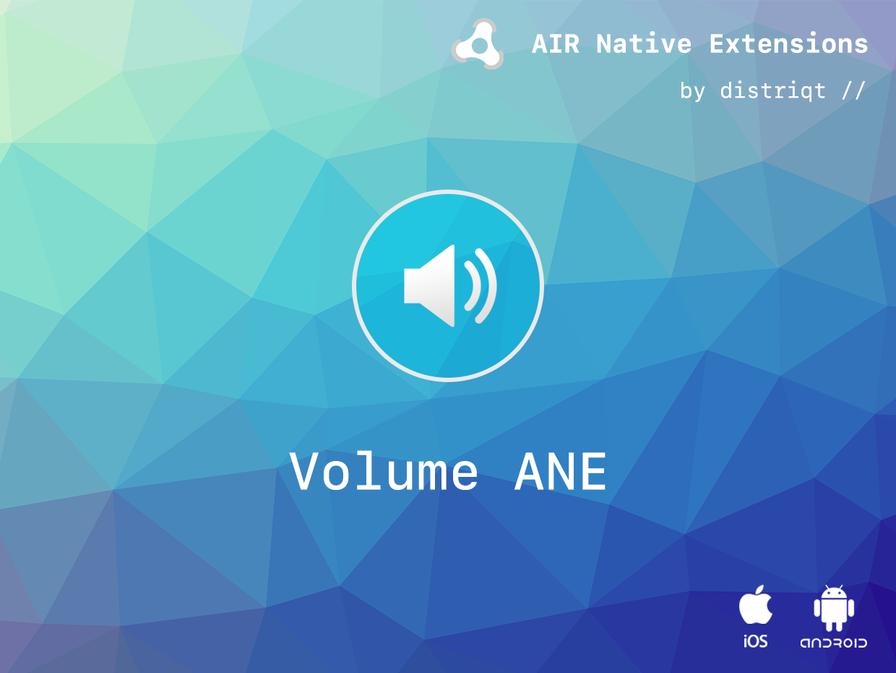
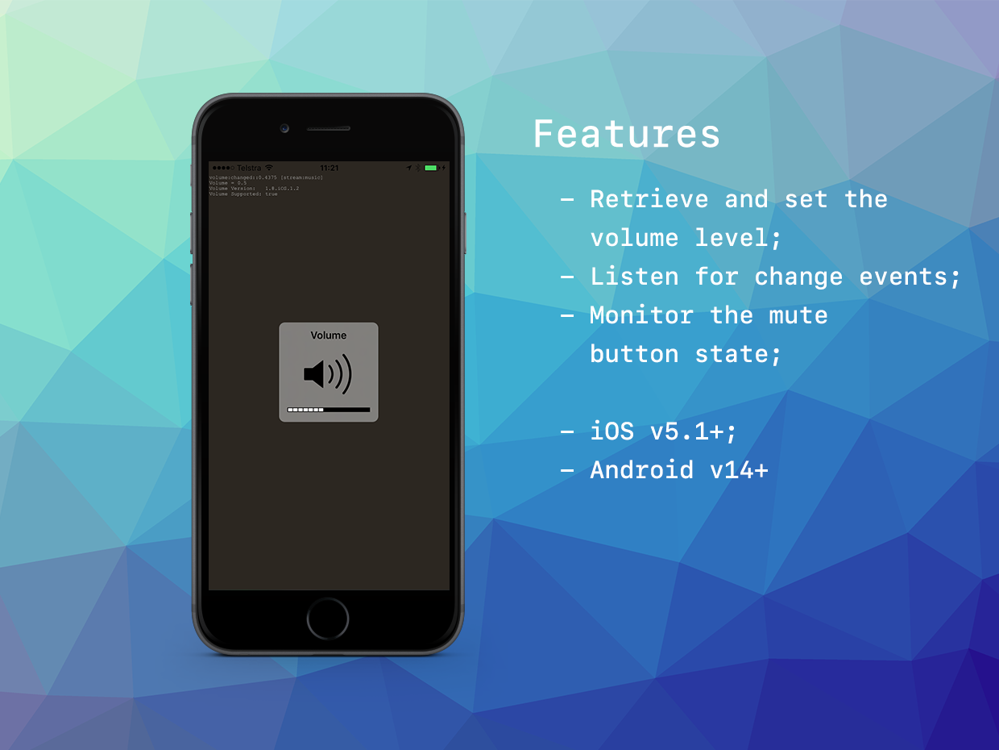

# Volume

The [Volume](https://airnativeextensions.com/extension/com.distriqt.Volume) extension 
gives you access to the native volume, including the ability to set and retrieve the volume level, 
listen for volume level change events and set the volume control on Android.

The simple API allows you to quickly integrate volume control in your AIR application in just a few lines of code.
Identical code base can be used across all platforms allowing you to concentrate on your application and not device specifics.

We provide complete guides to get you up and running with image capture quickly and easily.


### Features

- Retrieve and set the volume;
- Listen for volume change events;
- Monitor the mute button state


As with all our extensions you get access to a year of support and updates as we are continually improving and updating the extensions for OS updates and feature requests.


## Documentation


The [documentation site](https://docs.airnativeextensions.com/docs/volume) forms the best source of detailed documentation for the extension along with the [asdocs](https://docs.airnativeextensions.com/asdocs/volume). 


Quick Example:

```actionscript
var volume:Number = Volume.service.getVolume();
```


More information here: 

[com.distriqt.Volume](https://airnativeextensions.com/extension/com.distriqt.Volume)


## License

You can purchase a license for using this extension:

[airnativeextensions.com](https://airnativeextensions.com/)

distriqt retains all copyright.



