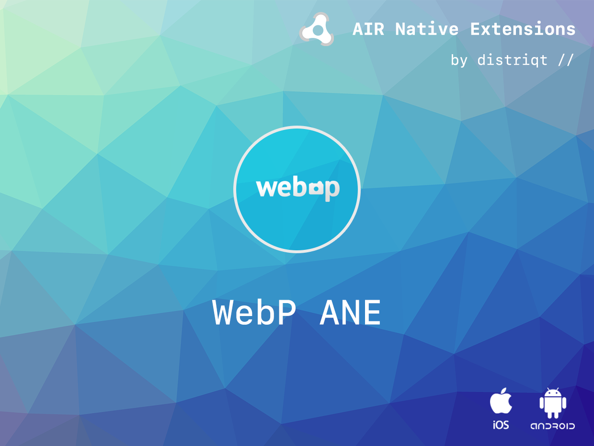
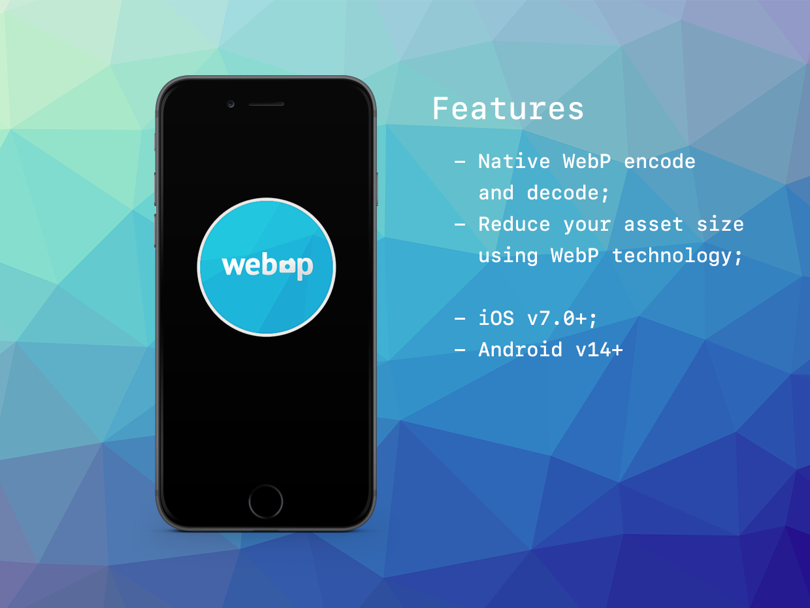

# WebP

The [WebP](https://airnativeextensions.com/extension/com.distriqt.WebP) extension 
gives you access to WebP functionality at native speeds.

WebP is a new image format that provides lossless and lossy compression for images on the web. 
WebP lossless images are 26% smaller in size compared to PNGs. WebP lossy images are 25-34% 
smaller in size compared to JPEG images at equivalent SSIM index. WebP supports lossless 
transparency (also known as alpha channel) with just 22% additional bytes. Transparency 
is also supported with lossy compression and typically provides 3x smaller file sizes 
compared to PNG when lossy compression is acceptable for the red/green/blue color channels.

For more on information on the format see the following page on Google Developers: 
[WebP](http://developers.google.com/speed/webp/)


### Features

- Load a WebP file using the `WebPLoader`;
- Parse WebP Data;
- Single API interface - your code works across supported platforms with no modifications;
- Sample project code and ASDocs reference
- Supports: iOS, macOS, Android, Windows

As with all our extensions you get access to a year of support and updates as we are 
continually improving and updating the extensions for OS updates and feature requests.


## Documentation

The [documentation site](https://docs.airnativeextensions.com/docs/webp) forms the best source of detailed documentation for the extension along with the [asdocs](https://docs.airnativeextensions.com/asdocs/webp). 

Quick Example:

```actionscript
if (WebP.isSupported)
{
	var bd:BitmapData = WebP.service.loadWebPBitmapData( path );
}
```


More information here: 

[com.distriqt.WebP](https://airnativeextensions.com/extension/com.distriqt.WebP)


## License

You can purchase a license for using this extension:

[airnativeextensions.com](https://airnativeextensions.com/)



