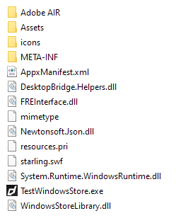

First step is always to add the extension to your development environment. 
To do this use the tutorial located [here](/docs/tutorials/getting-started).


## Dependencies

### Core ANE

The Core ANE is required by this ANE. You must include and package this extension in your application.

The Core ANE doesn't provide any functionality in itself but provides support libraries and frameworks used by our extensions.
It also includes some centralised code for some common actions that can cause issues if they are implemented in each individual extension.

You can access this extension here: [https://github.com/distriqt/ANE-Core](https://github.com/distriqt/ANE-Core).


## Extension IDs

The following should be added to your `extensions` node in your application descriptor to identify all the required ANEs in your application:

```xml
<extensions>
    <extensionID>com.distriqt.WindowsStore</extensionID>
    <extensionID>com.distriqt.Core</extensionID>
</extensions>
```


## Windows


### .Net Framework

This extension requires v4.6 or higher of the .Net framework. This should come preinstalled on any Windows 10 or higher machine so if you are targetting those you should not have to do anything. If however you are targetting older versions of Windows you must ensure .Net v4.6 or higher is installed either manually or as part of an installer.
 

### C++ Redistributable

The native code has a dependency on the Visual C++ 2017 Redistributable package. This package contains code that is required to run code developed using C++ in Visual Studio and is very common amongst Windows applications.

There are two ways to ensure this is available to your application:

- Create an installer that includes the redistributable installer;
- Package the required DLL files from the redistributable with your application;

The first is the suggested method. Installing the redistributable via an installer allows it to be put into the windows update process, allowing bug fixes and security updates to be handled automatically.

The second method is only advised if you need a complete standalone application, where you don't (or cannot) use an installation process. This requires you to package DLLs from the redistributable with your application. 


>
> NOTE: If you have previously packaged DLLs from the `windows_dll` directory, these are no longer required. We have packaged these internally to the extension and access them directly from there.
> **You should remove these DLLs from your application.**
>
> i.e. the DLLs in the image below are no longer required:
>
> 
>


### Creating an Installer

There are many methods to create application installers and many tutorials available. We suggest you find a method suitable to your environment and application and utilise the tutorials online. 

Some methods include:

- [Inno Setup](http://www.jrsoftware.org/isinfo.php)
- [Wix](http://wixtoolset.org/)
    - [WixEdit](http://wixedit.sourceforge.net)


Tutorials:

- [Generating a Windows installer](http://www.adobe.com/devnet/air/articles/customize-setup-for-AIR-app-with-captive-runtime.html)


You need to include the x86 c++ 2017 redistributable in the installer, there are many examples and documentation online to achieve this.


### Packaging DLLs

Packaging the DLLs into your application involves copying the DLLs specified below into your application root and including in your application package.

The best option is to install Visual Studio 2017 and locate the `Program Files[ (x86)]\Microsoft Visual Studio\2017\edition\VC\Redist\MSVC\lib-version` folder, eg: `C:\Program Files (x86)\Microsoft Visual Studio\2017\Community\VC\Redist\MSVC\14.16.27012\x86\Microsoft.VC141.CRT`

Alternatively, download and install the x86 redistributable from the [Microsoft website](https://support.microsoft.com/en-us/help/2977003/the-latest-supported-visual-c-downloads). This should install the DLLs into `C:\Windows\System32` folder. 


Open the folder and copy the following DLLs to your application:

- `msvcp140.dll`
- `vcruntime140.dll`

If you are having issues locating these files, feel free to contact us for help.


> 
> You should ensure you are allowed to package these files as per the Microsoft Software License terms but generally these are safe to redistribute subject to the license terms. More information here: [Redistributing Visual C++ Files](https://docs.microsoft.com/en-us/cpp/windows/redistributing-visual-cpp-files)
>
> You should get legal advice if you are unsure. 
>

