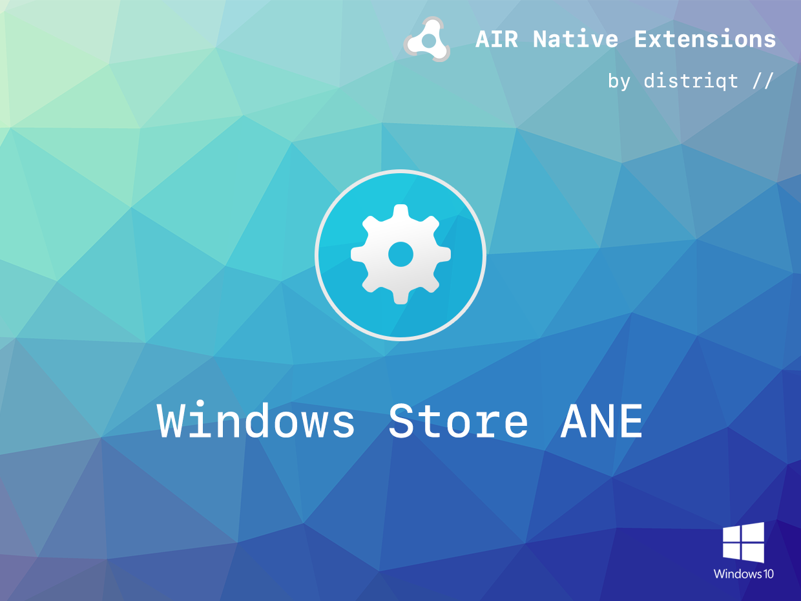

# WindowsStore

The [WindowsStore](https://airnativeextensions.com/extension/com.distriqt.WindowsStore) extension 
gives your UWP packaged AIR application the ability to make purchases of application add-ons through the Windows Store. 

### Features

- Query product information from the Windows Store
- Retrieve user's purchases
- Make a purchase of a product

This Wiki forms the best source of detailed documentation for the extension along with 
the [asdocs](https://docs.airnativeextensions.com/asdocs/windowsstore). 

