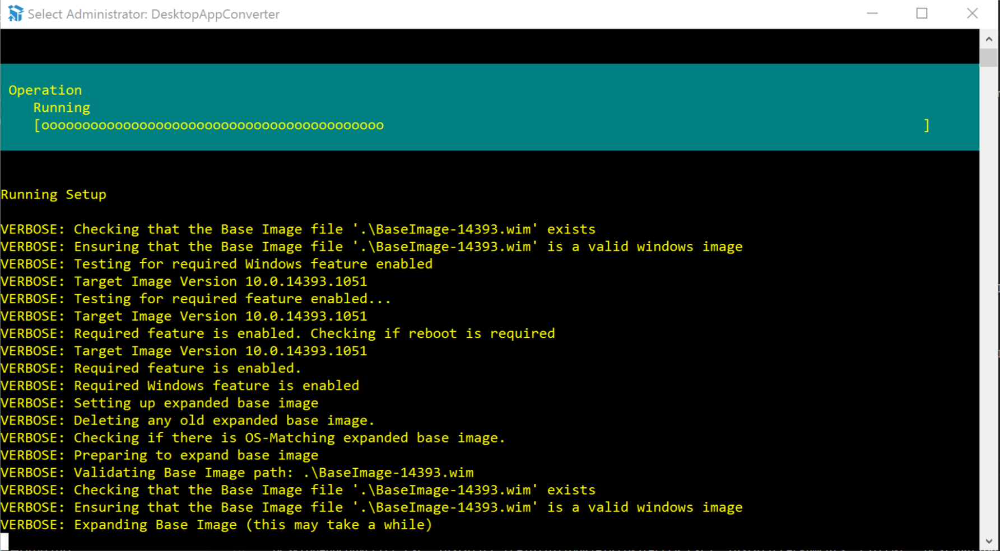

The Desktop App Converter can be used to turn your AIR application into an appex installer for the Windows Store. This is an important process to be able to convert your AIR app into a UWP application.

A brief article on the process can be found [here](https://blogs.msdn.microsoft.com/appconsult/2018/03/14/distribute-your-adobe-air-apps-through-the-microsoft-store-with-the-captive-runtime-bundle/)

More information on the Desktop App Converter can be found [here](https://docs.microsoft.com/en-us/windows/uwp/porting/desktop-to-uwp-run-desktop-app-converter).


This process involves the following steps:

- Setup the Desktop App Converter
- Create an Installer for your AIR application
- Convert to Windows Store application (`appx`)


>
> IMPORTANT: For this process to be successful you will need to package your AIR application with the captive runtime using the `-target bundle`. Shared runtime is not supported!
>


## Step 1 Setup the Desktop App Converter

To set up the Desktop App Converter (DAC):


1. [Download the Desktop App Converter](https://aka.ms/converter) app from the Windows Store.

> NOTE: If you are not using the installer for you don't need the `wim` file and you can skip to the next step once you have the converter installed

2. Based on your Windows build version (which you can check by opening the Start menu and typing winver), download an appropriate .wim file from the [Microsoft Store](https://aka.ms/converterimages).
3. Run the Desktop App Converter as an administrator on your computer.
4. In the prompt that appears, run this command: `Set-ExecutionPolicy bypass`
5. Set up the Desktop App Converter by running this command: `DesktopAppConverter.exe -Setup -BaseImage .\BaseImage-1XXXX.wim -Verbose`

> TIP: Don’t put the .wim file in a folder that contains other files, such as .iso or .exe files or any other installation files, because it will get copied to your C:\ drive.





## Step 2 Convert to Windows Store application

The next step is to convert the AIR application (`exe`) to a Windows Store application package (`appx`).


### Method 1

**Create appx from your AIR executable**

The output from your AIR application will be a directory, containing your `swf`, the `exe`, 
along with the AIR runtime, ANEs, DLLs, and all the other files packaged with your application.

This is the simplest method as you can use the output from the AIR SDK directly to create your Windows Store application (`appx`).

It is important that you only have files related to your project in the directory with your executable as anything in this directory will be copied to the final application. 

Here we use the `Installer` parameter to point to the root folder of your packaged app files. This is the folder containing the `AIRApp.exe` file generated by AIR.

```
DesktopAppConverter.exe 
    -Installer [PATH\TO\YOUR\AIR\OUTPUT] 
    -AppExecutable AIRApp.exe 
    -Destination [PATH\TO\OUTPUT] 
    -PackageName "[Package/Identity/Name]" 
    -PackageDisplayName "[DISPLAYNAME]" 
    -Publisher "CN=[Package/Identity/Publisher]"
    -PackagePublisherDisplayName "[Package/Properties/PublisherDisplayName]" 
    -AppDisplayName "[DISPLAYNAME]" 
    -Version [VERSION] 
    -MakeAppx 
    -Sign 
    -Verbose
```

- `-Installer` points to the root folder of your packaged AIR app files.
- `-AppExecutable` is the filename of your AIR application eg `AIRApp.exe`
- `-Destination` is where the DAC should produce the output of the command.
- `-MakeAppx` creates an .appx file that is the installation format of a Windows Store application.
- `PackageDisplayName`: Display package name for the application
- `AppDisplayName`: Display name for the application
- `-Sign` generates a certificate that you can install on your computer to test the generated package. When the final package is submitted to the Store, it is automatically signed by a trusted certificate during the process, so there is no need to do it later when you are ready to publish your application.
- `-Verbose` gives you better information while the conversion is happening.


Your app has a unique identity, assigned by the Store. In order to submit your application you will need to add some parameters setting information about your application from the developer dashboard. Identity details that can be found in the **App identity** section of your application in the developer dashboard. This information is required to correctly package your application for store submission however can be dummy values for local testing:

- `PackageName`: Package/Identity/Name
- `Publisher`: Package/Identity/Publisher
- `PackagePublisherDisplayName`: Package/Properties/PublisherDisplayName	


For example:

```
DesktopAppConverter.exe 
    -Installer C:\work\windowsstore\example\starling\out\TestWindowsStore
    -AppExecutable TestWindowsStore.exe 
    -Destination C:\work\windowsstore\example\starling\final
    -PackageName "distriqt.airnativeextensions" 
    -Publisher "CN=XXXXXXXX-XXXX-XXXX-XXXX-XXXXXXXXXXXX" 
    -PackagePublisherDisplayName "distriqt" 
    -PackageDisplayName "airnativeextensions" 
    -AppDisplayName "airnativeextensions" 
    -Version 1.0.0.0 
    -MakeAppx 
    -Sign 
    -Verbose
 ```


### Method 2

**Using an Installer for your AIR application**

You may already have an installer for your AIR application and wish to use this to create your Windows Store application (`appx`).

The output from your AIR application will be a directory, containing your `swf`, the `exe`, 
along with the AIR runtime, any ANEs, and all the other files packaged with your application.

You will then need to create an installer from this directory using one of the many windows 
installer tools, eg:

- [Wix](http://wixtoolset.org/)
    - [WixEdit](http://wixedit.sourceforge.net)
- [Inno Setup](http://www.jrsoftware.org/isinfo.php)


Tutorials:

- [Generating a Windows installer](http://www.adobe.com/devnet/air/articles/customize-setup-for-AIR-app-with-captive-runtime.html)


You now convert your AIR application installer to a Windows Store application (`appx`). It is important that you only have files related to your project in the directory with your installer (i.e. `C:\dac\installer` below) as anything in this directory will be copied to the virtual file system to run the conversion. 

To run the conversion, use the following command, replacing the [] items to match your setup:

```
DesktopAppConverter.exe 
    -Installer [PATH\TO\YOUR\AIR\INSTALLER] 
    -InstallerArguments "[INSTALLEROPTIONS]" 
    -Destination [PATH\TO\OUTPUT] 
    -PackageName "[Package/Identity/Name]" 
    -Publisher "CN=[Package/Identity/Publisher]" 
    -PackagePublisherDisplayName "[Package/Properties/PublisherDisplayName]" 
    -PackageDisplayName "[DISPLAYNAME]" 
    -AppDisplayName "[DISPLAYNAME]" 
    -Version [VERSION] 
    -MakeAppx 
    -Sign 
    -Verbose
```

- `-Installer` points to the installer that you want to use.
- `-InstallerArguments` is where you must specify the parameter that triggers the unattended setup procedure because DAC can only work with silent installers.
- `-Destination` is where the DAC should produce the output of the command.
- `-MakeAppx` creates an .appx file that is the installation format of a Windows Store application.
- `PackageDisplayName`: Display package name for the application
- `AppDisplayName`: Display name for the application
- `-Sign` generates a certificate that you can install on your computer to test the generated package. When the final package is submitted to the Store, it is automatically signed by a trusted certificate during the process, so there is no need to do it later when you are ready to publish your application.
- `-Verbose` gives you better information while the conversion is happening.


Your app has a unique identity, assigned by the Store. In order to submit your application you will need to add some parameters setting information about your application from the developer dashboard. Identity details that can be found in the **App identity** section of your application in the developer dashboard. This information is required to correctly package your application for store submission however can be dummy values for local testing:

- `PackageName`: Package/Identity/Name
- `Publisher`: Package/Identity/Publisher
- `PackagePublisherDisplayName`: Package/Properties/PublisherDisplayName	


For example with our msi generated using Wix:

```
DesktopAppConverter.exe 
    -Installer C:\dac\installer\TestDistriqt.msi
    -InstallerArguments "/quiet" 
    -Destination C:\dac\final
    -PackageName "distriqt.airnativeextensions" 
    -Publisher "CN=XXXXXXXX-XXXX-XXXX-XXXX-XXXXXXXXXXXX" 
    -PackagePublisherDisplayName "distriqt" 
    -PackageDisplayName "airnativeextensions" 
    -AppDisplayName "airnativeextensions" 
    -Version 1.0.0.0 
    -MakeAppx 
    -Sign 
    -Verbose
 ```

 


## Step 3 Testing the conversion

You can now install the `appx` application on your local machine. In order to do this you will need to install the certificate that was used to sign the application. This will called `auto-generated.cer` and be located in the output path alongside your `appx` application file. 


To install the certificate:

    - Double click cer file
    - Select "Install Certificate..."
    - Select "Local Machine"
    - Select "Place all certificates in the following store"
        - "Browse"
        - "Trusted Root Certification Authorities"

You can now install the application by double clicking the `appx` to launch the installer. This will install your application locally and have access to the UWP platform.


## Step 4 Submission

You should now be able to use the `appx` file to submit to the store. 

You must have acquired permission to submit Desktop Bridge applications before this step. If you haven't you will see the following error: 

>
> 	Package acceptance validation error: Your developer account doesn't have permission to submit apps converted with the Desktop Bridge at this time. https://aka.ms/desktopbridgeforwindowsstore
>


## External Docs 

- Package an app using the Desktop App Converter (Desktop Bridge) https://docs.microsoft.com/en-us/windows/uwp/porting/desktop-to-uwp-run-desktop-app-converter


## Acknowledgements 

This documentation is based on the [e-pity case study](https://microsoft.github.io/techcasestudies/desktop%20bridge/2017/06/08/e-pity.html)

