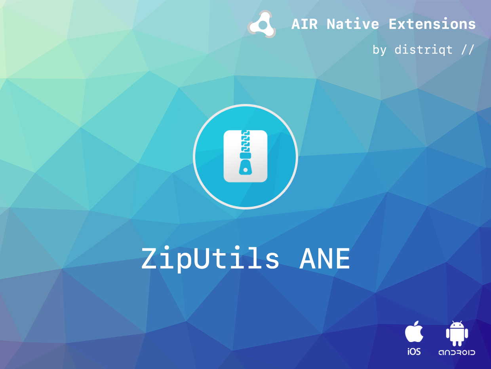

# Zip Utils

The [ZipUtils](https://airnativeextensions.com/extension/com.distriqt.ZipUtils) extension 
provides access to high performance zip utilities.

ZipUtils gives you access to zip functionality with native performance.

- Unzip a zip file to device storage
- Compress a folder or file into a zip file

We provide complete guides to get you up and running with the extension quickly and easily.

As with all our extensions you get access to a year of support and updates as we are 
continually improving and updating the extensions for OS updates and feature requests.

### Features

- Compress a folder or file into a zip file;
- Unzip a zip file to device storage;
- Default implementation using as3commons zip library;
- Single API interface - your code works across iOS and Android with no modifications;
- Sample project code and ASDocs reference

## Documentation

The [wiki](https://github.com/distriqt/ANE-ZipUtils/wiki) forms the best source of detailed documentation for the extension along with the [asdocs](https://docs.airnativeextensions.com/asdocs/ziputils). 

More information here: 

[com.distriqt.ZipUtils](https://airnativeextensions.com/extension/com.distriqt.ZipUtils)

## License

You can purchase a license for using this extension:

[airnativeextensions.com](https://airnativeextensions.com/)

distriqt retains all copyright.

