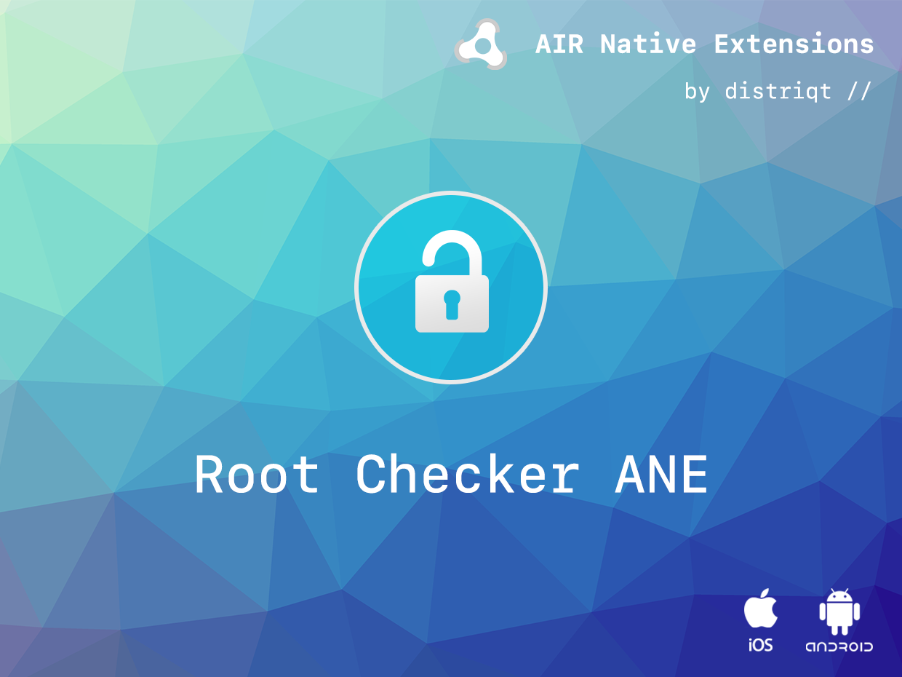

# RootChecker

The [RootChecker](https://airnativeextensions.com/extension/com.distriqt.RootChecker) extension 
gives you the ability to check whether the current device has been "rooted".

### Features

- Check for root access (jail broken device)

This Wiki forms the best source of detailed documentation for the extension along with 
the [asdocs](https://distriqt.github.io/ANE-RootChecker/asdocs). 

