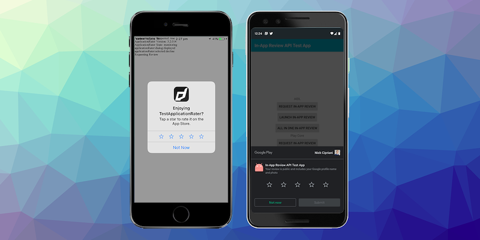

> Firebase, Facebook, Advertising, Game Services and more…

We are starting the year with a series of updates for some of our biggest extensions. With the privacy changes for IDFA in iOS 14 looming a lot of the advertising SDKs have been updated to get ready for this change. We have updates for AdMob and IronSource available to supposedly address these changes.

A lot of updates to start the year, so please let us know if there are any concerns about updating the extensions. We have migration guides available where the changes are significant so look for those in the documentation.

<!--truncate-->

### [Facebook Gaming Services](https://airnativeextensions.com/extension/com.distriqt.FacebookAPI)

We have released a new extension in the Facebook group that provides access to the Gaming Services SDK. The Gaming Services SDK allows applications configured as games through Facebook to access certain game specific functionality, including a simpler login process and additional native dialogs.

This new extension includes access to the Game Request dialog and Friend Finder dialog.

This release also includes an update of the Facebook SDK to version 8.2.0.

Available now in the Facebook API extension.

### [Firebase](https://airnativeextensions.com/extension/com.distriqt.Firebase)

A large update for Google services and Firebase has been released this month with the SDK going to versions:
- Android v26.3.0
- iOS v7.4.0

This update contains some API changes in Remote Config and some changes to the manifest additions for certain services. Check out the [migration guide](https://docs.airnativeextensions.com/docs/firebase/migrating-to-v6).

Additionally if you are using FCM or OneSignal (with the [Push Notifications](https://airnativeextensions.com/extension/com.distriqt.PushNotifications) extension) there have been some changes to the Firebase components there. See the push notifications [migration guide](https://docs.airnativeextensions.com/docs/pushnotifications/migrating-to-v10.1).

### [Application Rater](https://airnativeextensions.com/extension/com.distriqt.ApplicationRater)

The application rater ANE has been updated to include support for Huawei App Gallery, so your application will correctly open the App Gallery store if specified.

### [Adverts](https://airnativeextensions.com/extension/com.distriqt.Adverts)

AdMob SDK has been updated to the latest release including:
- Android v19.6.0
- iOS v7.69.0

This update includes some changes to the dependencies and manifest additions so make sure you check out the [migration guide](https://docs.airnativeextensions.com/docs/adverts/migrating-to-version-12).

### [IronSource](https://airnativeextensions.com/extension/com.distriqt.IronSource)

IronSource SDK has been updated to the latest v7.1.0 release including all the mediation adapters. This contains support for the latest iOS 14 changes.

### [Game Services](https://airnativeextensions.com/extension/com.distriqt.GameServices)

Updated to the latest Google Play Games to v21.0.0. As part of this release Google’s deprecated multiplayer functionality and has been completely disabled. So we have removed all this functionality from the extension and correctly report it not being supported on Google Play Games.

Turn based multiplayer is still available in Game Center.

---

As always, if you have any native development needs for AIR, Unity, Flutter or Haxe, please feel free to contact us at [airnativeextensions@distriqt.com](mailto:airnativeextensions@distriqt.com).