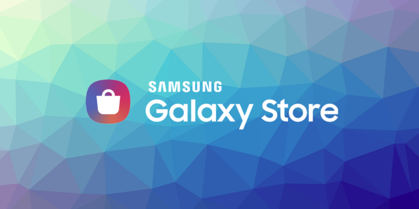

> APM, InAppBilling, OneSignal, Facebook and Unity

This month we have updated some of our most important extensions, including a new service for In-App Billing (Samsung and macOS), major SDK updates for OneSignal (Push Notifications) and Facebook.

Additionally we have released several of our extensions as Unity Plugins on the [Unity Asset Store](https://assetstore.unity.com/publishers/46451). This allows us to move into a new market while still bringing much needed tools to AIR. Any feedback is welcome.

### [AIR Package Manager](https://github.com/airsdk/apm)

Our lead developer is working on a pet project at the moment and is looking for support to get it off the ground.

>
> The AIR Package Manager allows management of AIR libraries and extensions and assists in creation of the application descriptor.
>

It’s a much needed missing part of the AIR ecosystem but unfortunately it’s too large a project for us to develop internally.
Have a look at the [repository](https://github.com/airsdk/apm) and if you have any thoughts and feel you could help please reach out, either by [sponsoring](https://github.com/sponsors/marchbold) or contributing.

<!--truncate-->

### [InAppBilling](https://airnativeextensions.com/extension/com.distriqt.InAppBilling)

InAppBilling now includes support for the Samsung Galaxy Store In-App Purchases. This builds upon the existing support for Google Play, Apple, Amazon and Huawei, so you have access to all the majors stores through one API.

We have added support for Apple AppStore purchases from macOS. So you can now support macOS, iOS and tvOS all through this extension.

Additionally Google Play Billing has been updated to the latest release (v3.0.2).

Get the best in-app monetisation extension [here](https://airnativeextensions.com/extension/com.distriqt.InAppBilling).

### [Push Notifications](https://airnativeextensions.com/extension/com.distriqt.PushNotifications)

OneSignal has been updated to the latest SDK which brings a raft of improvements to the platform under the hood. This update includes the following versions:
- iOS v3.1.1
- Android v4.1.0

Check out the extension [here](https://airnativeextensions.com/extension/com.distriqt.PushNotifications).

### [Facebook](https://airnativeextensions.com/extension/com.distriqt.FacebookAPI)

Facebook has released a major update to their SDK (v9.0.0). You probably have received a message along the following lines:

>
> Your current SDK is deprecated and will no longer be supported by Facebook. We will continue to allow API calls from your SDK for a transition period of two years. Starting January 20, 2023 we will fail all calls from deprecated SDKs. We encourage you to upgrade to v9.0 as soon as possible to avoid disruption to your application and to access all the benefits of our newest SDK.
>

This is a change as all previous versions of the SDK will stop working after the specified date.

As part of this update Facebook has introduced the concept of a “limited login” that allows developers to signal that a login is limited in terms of tracking users.

### [Unity Plugins](https://assetstore.unity.com/publishers/46451)

Several of our extensions are now available as Unity Plugins in the Unity Asset Store. This makes them extremely easy to integrate into your Unity project.

Currently we have the following plugins available:
- [Cloud Storage](https://assetstore.unity.com/packages/tools/integration/cloud-storage-161702) (iCloud)
- [App Group Defaults](https://assetstore.unity.com/packages/tools/integration/app-group-defaults-161703)
- [Application Rater](https://assetstore.unity.com/packages/tools/integration/application-rater-189253)

Check them out in the [store](https://assetstore.unity.com/publishers/46451). If there are any you think would be useful to your Unity project please let us know.

Note: If you already have a subscription to the AIR version of these plugins then you have access to the Unity Plugin for free.

---

As always, if you have any native development needs for AIR, Unity, Flutter or Haxe, please feel free to contact us at [airnativeextensions@distriqt.com](mailto:airnativeextensions@distriqt.com).