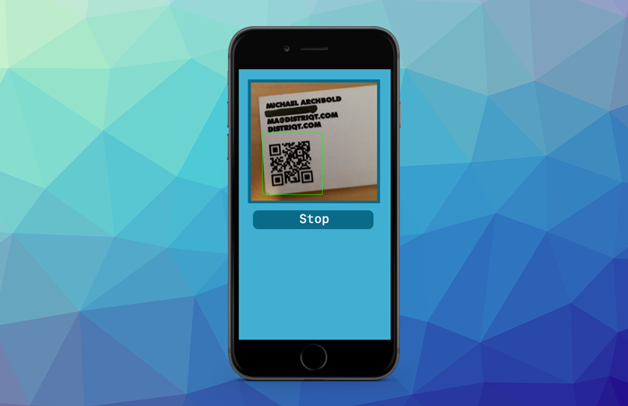

> Game Services, Vibration (Haptics), Scanning and more Unity.

Hope everyone is keeping safe out there. This month has seen some much requested updates to several of our extensions, including the Game Center access point, scanning within a viewport and haptic engine (vibrations) functionality. 

Additionally we have released some more Unity plugins available now for our subscribers and in the Unity Asset Store. 

We are also working towards some Flutter extensions and investing time in the platform. If anyone has any requests we are currently looking for a good initial project to expand our services, please feel free to get in [touch](mailto:airnativeextensions@distriqt.com). 

<!--truncate-->

### [Game Services](https://airnativeextensions.com/extension/com.distriqt.GameServices)

We have updated the Game Services extension to support the latest features in Game Center on iOS. This includes the "Access Point" functionality that shows a common Game Center UI element in your application.

Additionally we have added functionality to open generic UI elements directly allowing you to easily direct your users to the game service "dashboard".

Get the best game services extension [here](https://airnativeextensions.com/extension/com.distriqt.GameServices).

### [Vibration](https://airnativeextensions.com/extension/com.distriqt.Vibration)

Our Vibration native extension now supports the iOS Haptic Engine which you can use to engage users physically, with tactile feedback that gets attention and reinforces actions! Control the sharpness and intensity of vibrations to give highly engaging physical feedback from your application.

Check out the extension [here](https://airnativeextensions.com/extension/com.distriqt.Vibration).

### [Scanner](https://airnativeextensions.com/extension/com.distriqt.Scanner)

You can now use the Scanner extension to scan bitmap data for symbols (barcodes, qrcodes etc) directly or to position a camera preview for scanning within your AIR UI.

Additionally we have improved the camera compatibility on Android resolving some issues with less common device configurations.

The Scanner extension is available [here](https://airnativeextensions.com/extension/com.distriqt.Scanner). 

### [Unity Plugins](https://assetstore.unity.com/publishers/46451)

We have released two more plugins to the Unity Asset Store this month:

- [Vibration](https://assetstore.unity.com/packages/tools/integration/vibration-190518) 
- [Share](https://assetstore.unity.com/packages/tools/integration/share-188127)

Check them out in the [store](https://assetstore.unity.com/publishers/46451). If there are any you think would be useful to your Unity project please let us know.

**Note: If you already have a subscription to the AIR version of these plugins then you have access to the Unity Plugin for free.**

### [AIR Package Manager](https://github.com/airsdk/apm)

If you have any interest in supporting the development of APM we are still looking for sponsorship to be able to get this project started.

>
> The AIR Package Manager allows management of AIR libraries and extensions and assists in creation of the application descriptor.
>

It’s a much needed missing part of the AIR ecosystem but unfortunately it’s too large a project for us to develop internally.
Have a look at the [repository](https://github.com/airsdk/apm) and if you have any thoughts and feel you could help please reach out, either by [sponsoring](https://github.com/sponsors/marchbold) or contributing.

---

As always, if you have any native development needs for AIR, Unity, Flutter or Haxe, please feel free to contact us at [airnativeextensions@distriqt.com](mailto:airnativeextensions@distriqt.com).

