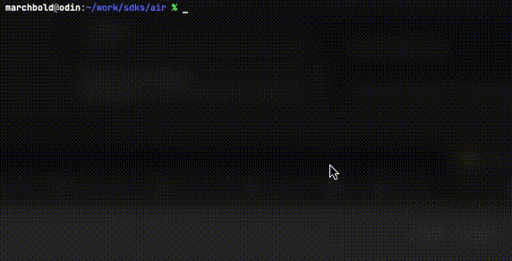

> APM, AdMob 

Here we are already at the mid point of the year! This month has been lots of internal work for us here at distriqt and not a lot of public releases, so this will be a short one this month.

I have mainly been focussed on APM, and am really excited to get this tool out to developers.

<!--truncate-->

### [AIR Package Manager](https://github.com/airsdk/apm)

We are very excited to be working on APM. We have made a lot of progress in the past month and are hoping for some alpha releases in July.

We have the base package repository working now and APM will `search`, `view`, and `install` packages along with initial conflict management.

We have also added in some preliminary tools to download and install the AIR SDK, including the ability to list available sdks and their release notes.

If you are at all interested in testing out the client we suggest you watch the [repository](https://github.com/airsdk/apm) for some releases in July. And make sure to check out the [wiki](https://github.com/airsdk/apm/wiki) to see the direction we are taking with the tool.

If you have any thoughts and feel you could help please reach out, either by [sponsoring](https://github.com/sponsors/marchbold) or contributing.

### [Adverts](https://airnativeextensions.com/extension/com.distriqt.Adverts)

If you use the Adverts extension for AdMob you may have had some issues with passing review due to the inclusion of the legacy consent SDK. This has now been removed so make sure you update to the new User Messaging Platform for your consent with AdMob before your next release.

See the documentation on the [User Messaging Platform](https://docs.airnativeextensions.com/docs/adverts/user-messaging-platform/).

Please note, if you are using Huawei Ads you will still use the consent SDK API in our extension.

---

As always, if you have any native development needs for AIR, Unity, Flutter or Haxe, please feel free to contact us at [airnativeextensions@distriqt.com](mailto:airnativeextensions@distriqt.com).

