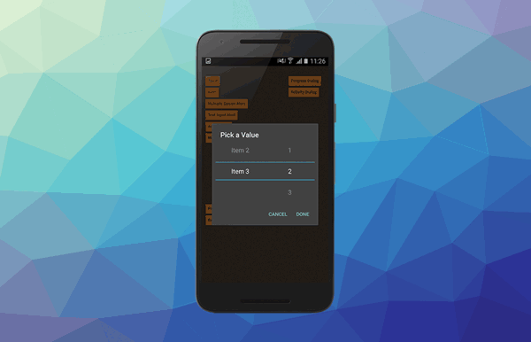

> APM, Dialog, ironSource 

What an exciting month for AIR! Harman now has a feasible solution for publishing to AAB on Android and excitingly for us, we have released the first beta of the AIR Package Manager!

I am really excited to get this tool out to developers.

<!--truncate-->


### [AIR Package Manager](https://github.com/airsdk/apm)

We are very excited to release the first beta of APM! It's available now in the repository for Windows and macOS (though it should work anywhere that supports `adl`).

We have made a lot of progress in the past month and are really happy with the progress. The project setup and configuration has been completed to allow you to create a project definition and configuration parameters.


We also have a complete package repository setup and APM will `search`, `view`, `install`, `uninstall` and `update` packages along with our initial take on conflict management.

You can also start creating your own packages, though currently you'll need to reach out to us to be given permission to publish to the repository. We are really excited that the latest release of [`starling`](https://repository.airsdk.dev/packages/starling) is already available in the repository!

#### AIR SDK

The preliminary tools to `list`, `view` and `install` the AIR SDK are available, which includes the ability to see the change log and readme associated with each release.

```shell
$ apm airsdk view 33.1.1.554 
✓ Retrieved AIR SDK information : 33.1.1.554
AIR SDK v33.1.1.554
  Release Date: 2021-07-13
  Release Notes:
    [Github-516] : Updating guava library used by ActionScript compiler to remove illegal reflection
    [Github-835] : Signing on mac using codesign without using Sun Java private classes
    [Github-894] : Updating avmplus to allow coercion between Vectors of related types
    [Github-934] : Supporting ANEs with multiple packages containing the same resource folder
    [Github-934] : Ensuring Android TV apps can be built with the right manifest for a bundle
    [Github-934] : Adding multidex library support into Android App Bundle generation
    [Github-936] : Updating code-signing and dependencies in iOSBin
    [Github-938] : Ensuring Android SDK detection copes with spurious folders under build-tools
    [Github-939] : Fixing crash with Android external storage directory call
    [Github-947] : Ensuring developers can use -resdir for Android App Bundles
    [Github-951] : Fixing Gradle issue when using non-ascii characters in an app 'name' field
    [Github-957] : Ensure we ignore manually added multidex-*.jar files
    [Github-957] : Support vector drawables support library for Android SDK below 21
    [Github-958] : Cleaning up temp folders created during AAB packaging
    [Github-968] : Fixing Android-x64 platform string for ANEs
```


#### Get Involved

This tool is for the community, so we really want your feedback. It is opensource and publicly available now. If you are at all interested in testing out the client we are looking for any and all feedback! Check out the [wiki](https://github.com/airsdk/apm/wiki) for installation details. 

If you have any thoughts and feel you could help please reach out, either by [sponsoring](https://github.com/sponsors/marchbold) or contributing directly through the repository.




### [Dialog](https://airnativeextensions.com/extension/com.distriqt.Dialog)

New iOS 14 date / time dialogs are now available in the Dialog extension. This feature brings the Android and iOS implementations closer in functionality with the new iOS style for date selection closely matching the existing Android calendar selection style.


Additionally we added some new features to text input dialogs, including "auto-capitalisation" and "auto-correct" options. 

Check out the extension [here](https://airnativeextensions.com/extension/com.distriqt.Dialog). 


### [IronSource](https://airnativeextensions.com/extension/com.distriqt.IronSource)

Our free IronSource extension has gotten another update to support the latest ironSource SDK, including updates for all the available mediation network extensions.

This update brings the extension to version: 
- Android v7.1.7
- iOS v7.1.7

We also added some API functions to handle the new requirements for using Facebook Audience Network on iOS. 

If you are using this extension, we welcome any support in keeping it updated via [sponsoring us on github](https://github.com/sponsors/distriqt).


---


As always, if you have any native development needs for AIR, Unity, Flutter or Haxe, please feel free to contact us at [airnativeextensions@distriqt.com](mailto:airnativeextensions@distriqt.com).


