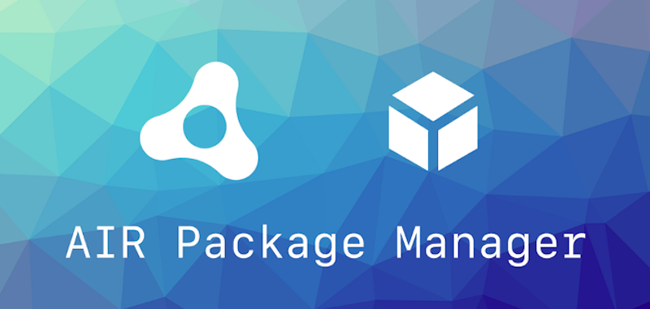

> Android 12 (API 31)

What a hectic month! But the great news is that all of our extensions have been updated to the latest Google Play Services and androidx libraries including all the air packages for use in apm!

<!--truncate-->


### Android 31

All of our changes for the latest Android release are now available.

There are a lot of changes related to new dependencies and manifest additions. We know this is can be a daunting migration when dealing with major changes to the manifest so make sure you check the documentation in detail for the extensions you are using.

The most common issue we are seeing is the change in the `androidx.core` lib that has changed the main lifecycle listener that a lot of libraries use. If you previously had the `androidx.lifecycle.ProcessLifecycleOwnerInitializer` provider in your manifest it needs to be removed and replaced with the following `androidx.startup.InitializationProvider`:

```xml
<provider
    android:name="androidx.startup.InitializationProvider"
    android:authorities="APPLICATION_PACKAGE.androidx-startup"
    android:exported="false" >
  <meta-data
      android:name="androidx.lifecycle.ProcessLifecycleInitializer"
      android:value="androidx.startup" />
</provider>
```

*Note if you already have an instance of this provider you need to merge the meta-data into the one instance.*




### apm

We have been working few a couple of small teething issues with apm but it’s great to see so many of you using this new tool to simplify your AIR development and integration of extensions. Please [let us know if you run into any issues](https://github.com/airsdk/apm/discussions) and we will keep improving this tool over time.

For anyone having issues with caching, it can be useful to delete the `apm_packages` directory and run `apm install` again. This will use the version of the extensions identified in your lock file and download the latest versions again.


---

As always, if you have any native development needs for AIR, Unity, Flutter or Haxe, please feel free to contact us at [airnativeextensions@distriqt.com](mailto:airnativeextensions@distriqt.com).
