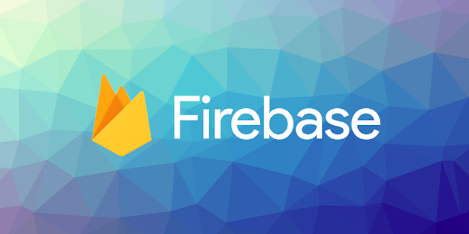

> Extension Updates

This month has been full of update releases. We have been working on a series of updates for some of our major extensions over the past few months and many of them have been released this month. 

- Facebook 
- Firebase
- PushNotifications (FCM + OneSignal)
- Adverts
- IronSource


<!--truncate-->


### Facebook

This latest update brings an update to the iOS SDK. Recent AIR SDK updates has meant we can finally bring a much more recent version of the Facebook SDK to AIR developers on iOS which should be a welcome update to anyone who uses Facebook social or login features in their application. The API has remained unchanged but internally it will be using a much more recent version of the SDK. 

Additionally some critical fixes were released including fixing an issue with session not persisting across launches on iOS. 

---



### Firebase

This update brings an update to the iOS SDK. Similar to the Facebook extension, recent updates to the AIR SDK has meant we can now bring a more recent version of the Firebase SDK to iOS developers. This should bring a range of bug fixes and improvements to the underlying Firebase SDK.

Firebase Storage extension now provides the ability to [list files](/docs/firebase/storage/list-files) that you have stored in your storage bucket:

```actionscript
var ref:StorageReference = FirebaseStorage.service.getReference();
ref.addEventListener( StorageReferenceListEvent.SUCCESS, listSuccessHandler );
ref.addEventListener( StorageReferenceListEvent.ERROR, listErrorHandler );
ref.listAll();

function listSuccessHandler( event:StorageReferenceListEvent ):void 
{
    // Contains a list of "items" - each represents a storage item 
    for each (var item:String in event.items)
    {
        var ref:StorageReference 
          = FirebaseStorage.service.getReference( item );
    }
}
```

---


### Push Notifications

The FCM implementation has been brought inline with the latest Firebase extension bringing a recent version iOS and Android Firebase SDK. This should bring some bug fixes and improvements from the underlying Firebase Messaging SDK:

- Android v23.0.0
- iOS v8.15.0

The OneSignal SDK has also been updated and now includes v4.7.3 on Android. 

This update also brings a range of bug fixes.

---


### Adverts

Version 13.6 brings version 9+ of the AdMob iOS SDK which includes some significant changes to the SDK. Most of the changes have been handled internal to the extension however there is one important piece of information that you must be aware of:


> **Ads stop serving on iOS 10**
> 
> The minimum iOS version the Google Mobile Ads SDK version 9.0.0 supports is iOS 11.
>
> Upgrading to Google Mobile Ads SDK version 9.0.0 will not break your app on iOS 10 devices, however, no ads will be served on those devices.
>

Additionally mediator adapters have been updated to bring inline with this version of the AdMob SDKs.


#### Life Time Value (LTV)

This update also includes the preview implementation of the life time value events.

Most of the adverts will now dispatch a `PaidEvent.PAID` event with information on the revenue obtained for presenting an advert. By implementing this event handler, you can use the data to calculate a user's life time value, or forward the data downstream to other relevant systems.

More information in the [Life Time Value](/docs/adverts/life-time-value) section.

---


### IronSource

The free ironSource extension has been updated to the latest version of the ironSource SDK:

- Android v7.2.2
- iOS v7.2.2.1

Additionally all supported mediation adapters have been updated to be inline with this release of the ironSource SDK.

:::info Sponsoring
If you use this extension regularly we do ask that you consider sponsoring the development to allow us to continue updating the extension. You can find details on sponsoring the extension [here](https://github.com/distriqt/ANE-IronSource). 
:::

---

As always, if you have any native development needs for AIR, Unity, Flutter or Haxe, please feel free to contact us at [airnativeextensions@distriqt.com](mailto:airnativeextensions@distriqt.com).
