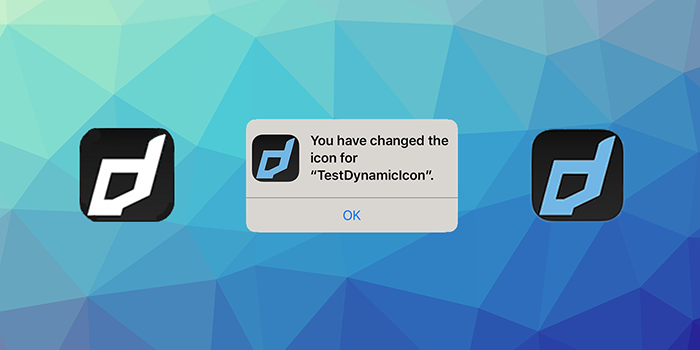

> APM Update, InAppBilling testing

This month a series of smaller updates have been released including updates for Firebase, Adverts and Share extensions to address some minor issues that were found in the extensions.

Importantly APM v1.2.0 has been released! If you aren't using APM to manage your extensions we highly recommend spending a small amount of time to migrate to using this tool. It will save you an enormous amount of time maintaining your application descriptor particularly for Android builds when needing to update the manifest additions.  

<!--truncate-->

### [APM](https://github.com/airsdk/apm)

The AIR Package Manager has had an update this month with `v1.2.0` being released. This update includes some better management of the data files keeping the order of the contents in the files more consistent which should improve their usage in version control systems such as git. 

Additionally several updates and fixes were included, particularly around an issue with a failed update where the installed extensions were lost. 

See the full release notes [here](https://github.com/airsdk/apm/releases/tag/1.2.0).

If you are looking to get started with APM we recommend checking out the [migration guide](https://github.com/airsdk/apm/discussions/75) which goes through a case study of an application we migrated to APM.

---

### [InAppBilling](https://airnativeextensions.com/extension/com.distriqt.InAppBilling)

Our InAppBilling extension is in final testing before the release containing the update to the latest version of the Google billing library (version 5). 

We have had to make some changes to the API particularly around subscriptions and discounts. If you have the capability to help us test, we are looking for people to test the beta release before we finalise the API and changes to the extension. Just drop a note on this issue and we'll get you the latest beta version as soon as it's available: https://github.com/distriqt/ANE-InAppBilling/issues/482

---

### [IronSource](https://airnativeextensions.com/extension/com.distriqt.IronSource)

Our IronSource extension has been updated to the latest release including all mediators. 

There were some issues with the previous release with some of the mediators conflicting with the version of playservices in use. This has now been resolved and all the mediators should be working again.

---

### [DynamicIcon](https://github.com/distriqt/ANE-DynamicIcon)

Our DynamicIcon extension has been updated to use icons from the ios asset catalogue with the latest xcode 13 tools. You now can package your alternative icons in your asset catalogue along with your main application icon and launch images.

---

As always, if you have any native development needs for AIR, Unity, Flutter or Haxe, please feel free to contact us at [airnativeextensions@distriqt.com](mailto:airnativeextensions@distriqt.com).
