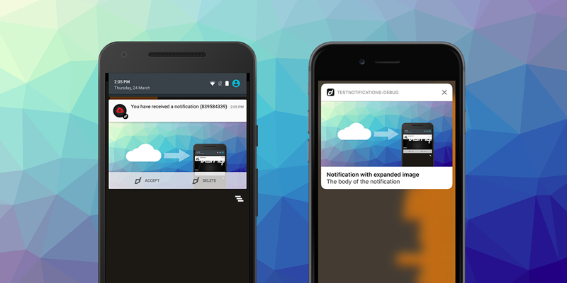
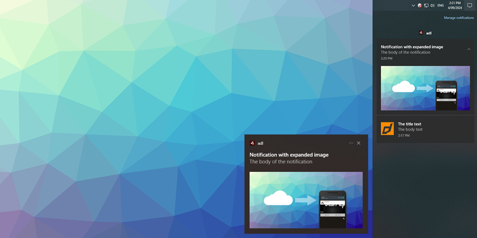

> Notifications, Game Services, InAppBilling, Firebase Dynamic Links, Adverts, ironSource

Recently we have released updates to several of our main extensions, key updates include:

- Notifications on windows from non-UWP applications
- Play Games Services v2 integration through GameServices and access through Google Play Games on PC
- InAppBilling Play Billing update to v6.2.1
- AdMob update to the latest SDK (Android and iOS)
- ironSource update to the latest SDK (Android and iOS)

Lots of Android and specifically Google related updates ensuring your applications can meet the latest requirements for the Play Store.

As always, if you have any development needs for AIR, Unity, Flutter or Haxe, please feel free to contact us at [airnativeextensions@distriqt.com](mailto:airnativeextensions@distriqt.com).

<!--truncate-->

--- 



### [Notifications](https://airnativeextensions.com/extension/com.distriqt.Notifications)

Notifications extension has been updated to allow notifications on Windows from non-UWP applications. This will enables native windows notifications in many more scenarios including normal captive runtime AIR applications. 



There should be no code modifications required for this addition but will enable notifications from any packaged windows application.


---


### [GameServices](https://airnativeextensions.com/extension/com.distriqt.GameServices)

GameServices has been updated to support the Play Games Services v2 SDK. 

The Play Games Services v2 SDK brings a number of improvements that increase the number of users signed into your game, and make development easier.

Improvements for users:
- After selecting a default account, users are logged-in without needing to interact with a prompt.
- Users no longer need to download the Play Games App to sign-in with Play Games Services or create a new account.
- Users can now manage their Play Games Services accounts for multiple games from a single page.

Improvements for developers:
- Client code no longer needs to handle the sign-in or sign-out flow, as login is automatically triggered when the game starts, and account management is handled in the OS settings.

The extension has made this process seemless so you shouldn't need to change any code, however be aware that users will likely be signed in automatically now and you will receive a sign in event after initialising the service.

**Note:** With this update screen recording is no longer supported as it isn't available in the v2 SDK and you cannot trigger a sign out from with in your application.

:::info Google Play Games on PC
With this update comes support for Google Play Games on PC. 

*Google Play Games is a PC application that lets you browse, download and play selected mobile games on a Windows desktop or laptop. Besides enjoying your favourite Android games on a PC, you’ll have keyboard and mouse access, seamless sync across devices and integration with Google Play Points.*

This application is currently in beta but looks like a promising avenue for AIR developers to further extend their applications reach bringing mobile games directly to the desktop environment.

You can find out more about Google Play Games on PC [here](https://play.google.com/googleplaygames).
:::


#### Updating 

If you are using `apm` then a simple update and regeneration of the app descriptor should be all you'll need to do:

```
apm update
apm generate app-descriptor
```

If you are still managing your dependencies and app descriptor manually, double check the [documentation](https://docs.airnativeextensions.com/docs/gameservices/service/playgames/add-the-extension) and ensure your manifest matches the latest content. 


--- 


### [InAppBilling](https://airnativeextensions.com/extension/com.distriqt.InAppBilling)

InAppBilling has been updated to support the latest version of the Google Play Billing Library (v6.2.1). 

We highly recommend updating your billing to the latest version to ensure you have the best experience for your users when purchasing in app products and subscriptions. 


#### Updating 

If you are using `apm`:

```
apm update
apm generate app-descriptor
```

If you are still managing your dependencies and app descriptor manually, have a look at the [migration guide](https://docs.airnativeextensions.com/docs/inappbilling/migration-v15.4). 

:::caution
Please be aware if you are still manually updating your manifest that some developers have been missing a critical entry when updating this extension. Play Billing version is included in the manifest and needs to be updated with each release. Failing to update it may mean you get an error when attempting to release your application to the Play Store.

The entry of concern is:

```xml
<meta-data 
    android:name="com.google.android.play.billingclient.version" 
	android:value="6.2.1" />
```
:::

--- 


### [Firebase](https://airnativeextensions.com/extension/com.distriqt.Firebase)

Reminder the Firebase Dynamic Links will discontinue service on August 25, 2025. 

What you need to know:

- On August 25, 2025, all links served by Firebase Dynamic Links (both those hosted on custom domains or on page.link subdomains) will stop working. Your new and existing links will continue to work until the Firebase Dynamic Links service is discontinued. 
- Firebase projects that have already enabled Firebase Dynamic Links will be able to continue using existing links and creating new ones during the sunset window (between now and August 25, 2025).
- As of August 19, 2023 the Firebase Dynamic Links SDK and service have only been receiving updates for critical or security related issues. New or existing projects cannot enable Firebase Dynamic Links unless they were already enabled to prevent building new dependencies as the product prepares for shut down.

What you need to do:

Take the following actions before August 25, 2025:

- Review your use-cases to evaluate, decide and potentially adopt alternative solutions.
- Complete your migration from Firebase Dynamic Links.
- Delete your domain prefixes from Firebase Dynamic Links after successfully migrating your links and use-cases.

The Firebase Dynamic Links extension will only receive updates for critical or security related issues in line with the SDK updates.

---


### [Adverts](https://airnativeextensions.com/extension/com.distriqt.Adverts)

The latest release of the Adverts extension brings the latest AdMob SDK, v23.3.0 on Android and v11.8.0 on iOS. Additionally it updates UMP to v3.0.0. 

We have also updated all the supported mediation networks to their latest releases:

- AppLovin: android v12.6.0, ios v12.6.1
- Facebook: android v6.17.0, ios v6.15.1
- ironSource: android v8.2.1, ios v8.2.0
- Pangle: android v6.1.0.7, ios v6.1.0.6
- UnityAds: android v4.12.2, ios v4.12.2

:::note 
With this release it seems there is an issue with the iOS SDK included with the AIR SDK which can cause a crash on launch of your iOS application. 
We have found that some versions of AIR seem to fail if you don't supply a version of the iOS SDK. 
You can do this via the adt `platformsdk` command line option:

```
adt ... -platformsdk /Applications/Xcode.app/Contents/Developer/Platforms/iPhoneOS.platform/Developer/SDKs/iPhoneOS17.5.sdk
```

Or via the AIR SDK Manager, under *Configuration* / *iOS*:


> The default install location is /Applications/Xcode.app/Contents/Developer/Platforms/iPhoneOS.platform/Developer/SDKs/iPhoneOSXX.X.sdk, you'll need to confirm the version XX.X available on your system. 

Additionally please note that AdColony and TapJoy have been deprecated.
:::


This update should resolve a known issue with the UnityAds SDK.

If there are additional mediation networks you would like supported please let us know via the [repository](https://github.com/distriqt/ANE-Adverts-Mediation)!


---


### [ironSource](https://airnativeextensions.com/extension/com.distriqt.IronSource)

The latest release of the ironSource extension brings the latest SDK, v8.3.0 on Android and v8.3.0 on iOS.

We have also updated all the supported mediation networks to their latest releases:

- Ad Quality SDK: android v7.20.5, iOS v7.20.6
- AdMob: android v4.3.44 (v23.3.0), ios v4.3.56 (v11.7.0)
- AppLovin: android v4.3.45 (v12.6.0), ios v4.3.47 (v12.6.0)
- Chartboost: android v4.3.16 (v9.7.0) ios v4.3.19 (v9.7.0)
- Digital Turbine: android v4.3.32 (v8.2.7) ios v4.3.36 (v8.3.1)
- Facebook Audience: android v4.3.47 (v6.17.0) ios v4.3.46 (v6.15.2)
- Unity Ads: android v4.3.42 (v4.12.2) ios v4.3.42 (v4.12.2) 
- Vungle: android v4.3.25 (v7.4.0) ios v4.3.36 (v7.4.0)

This update should resolve a known [issue](https://github.com/distriqt/ANE-IronSource/issues/68) with the UnityAds SDK.

---

