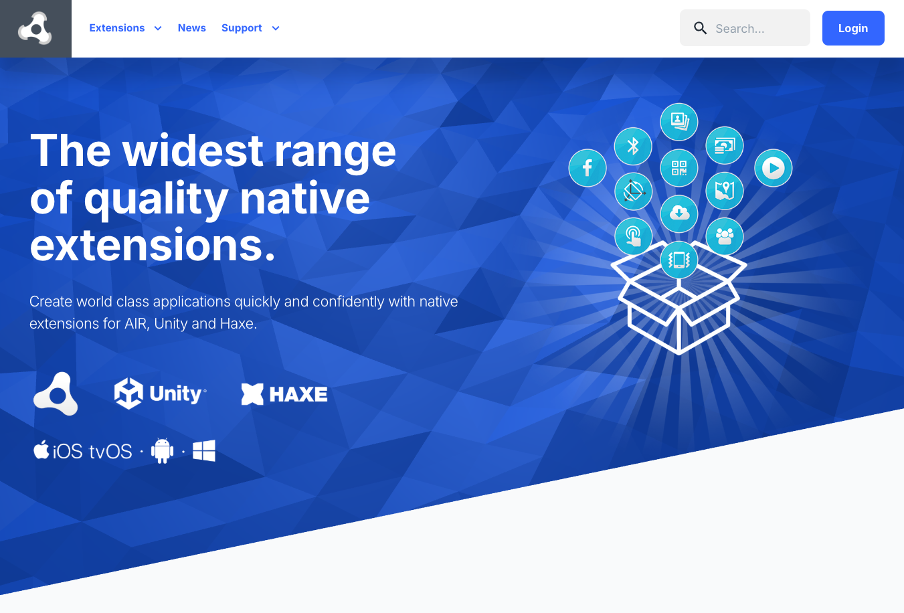
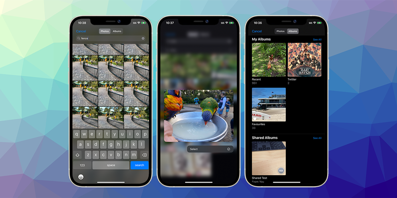

> New website release, extension updates!

Over the past few months, we've been working intensively to rebuild [airnativeextensions.com](https://airnativeextensions.com), primarily to integrate a new payment provider and ensure we can continue delivering extensions to developers worldwide. It’s been a significant undertaking, but we’re confident the improvements to the platform will be well worth it.

What this means for you:

- Nothing will change in the near future
- All new purchases will be done through our new payment provider
- We are asking all clients to migrate to the new payment provider 

We've made migration easy and allows you to combine your subscriptions into a single payment if you want. More information below.

:::note Extension Updates
- [Scanner](https://docs.airnativeextensions.com/news/2025-06#scanner) v6.0.5 - Major Upgrade for Barcode Scanning
- [Share](https://docs.airnativeextensions.com/news/2025-06#share) v8.1.0 - SMS Reading Added on Android
- [InAppBilling](https://docs.airnativeextensions.com/news/2025-06#inappbilling) v16.1.2 - Improved handling of subscription offer details and purchase flow
- [InAppUpdates]https://docs.airnativeextensions.com/news/2025-06#inappupdates) v3.0.1
- [Vibration](https://docs.airnativeextensions.com/news/2025-06#vibration) v5.4.2
- [CameraRollExtended](https://docs.airnativeextensions.com/news/2025-06#camerarollextended) v8.0.2 - Fixed image loading and permissionless picker issues
- [Adverts](https://docs.airnativeextensions.com/news/2025-06#adverts) v16.1.0 - Updated SDKs
- [CrashUtils](https://docs.airnativeextensions.com/news/2025-06#crashutils) v0.0.2 - New **free** extension
- [DetectScreenshot](https://docs.airnativeextensions.com/news/2025-06#detectscreenshot) v1.0.0 - New **free** extension
- [NFC](https://docs.airnativeextensions.com/news/2025-06#nfc) v5.6.1
:::

Got questions? We're here to help! [Let's build better, faster, and smarter together.](https://docs.airnativeextensions.com/news/2025-06#custom-development-work) 💡

<!-- truncate -->

--- 

### New Site Released

Thank you for supporting the ongoing development of our AIR extensions! 

Our new site has been released and as part of our commitment to the AIR community, we're excited to announce that we've upgraded our subscription management system to provide you with a better, more streamlined experience.

We really hope the new site is easier to navigate and manage your subscriptions!

#### Migrating

This upgrade includes a migration to a new payment provider, ensuring we can continue supporting our extensions while offering greater flexibility and ease of use.

To continue using your extensions, please migrate your existing subscriptions to the new system. It's a quick and easy process:

1. Select the extensions you'd like to migrate.
2. We'll calculate the remaining time on your current subscriptions and apply a discount to your new subscription(s).
3. Choose your payment method and complete the payment.
4. You'll receive a confirmation email with all the details of your new subscription.

:::note
Existing subscriptions that you migrate together will be grouped into a single subscription. You should note that this means you'll be billed for these together and also that if you look to cancel in the future you will need to cancel all extensions associated with the subscription. 

You may wish to migrate extensions individually based on your needs.
:::

We understand that change can be challenging, but we believe this upgrade will ultimately enhance your experience with our extensions. Our new system offers improved management tools, better support, and a more user-friendly interface. We appreciate your continued support and look forward to bringing you even more improvements in the future!

If you notice any issues or have any concerns, please reach out to me [airnativeextensions@distriqt.com](mailto:airnativeextensions@distriqt.com)

### Feedback

With the release of the new site I'm genuinely excited about where we're heading with AIR native extensions. But more than anything, I want to make sure we're building the right tools in the right way for you.

So I'd really love your feedback:

**What would make these extensions more valuable or accessible for your projects?**

- Would different **pricing options** help (subscriptions, bundles, site licenses)?
- Are there specific **platforms, features, or ANEs** you'd like to see next?    
- Would you benefit from **better docs**, **support**, or maybe even **open-source components**?
      
One area I'm especially looking at is expanding support for **APM (AIR Package Manager)**, not just for managing extensions, but also for **project creation and scaffolding**. If that's something you'd use, let me know how we can make it awesome.

And if there's **anything currently stopping you from using our extensions**, I'd really appreciate hearing about that too - even small pain points are worth solving.

Drop a [comment](https://github.com/airsdk/Adobe-Runtime-Support/discussions/3850), [message me directly](mailto:airnativeextensions@distriqt.com), or reach out via the site - I'm all ears. Your feedback genuinely shapes what we do next.

Thanks for being part of this community, let's keep AIR development strong!

--- 

### [Scanner](https://airnativeextensions.com/extension/com.distriqt.Scanner)

Released June 19, 2025, this release represents a major overhaul of the Scanner extension.

- The scanning algorithm has been completely rewritten for improved **performance** and **accuracy**.
- The aging ZBar SDK has been replaced by **MLKit** on Android and the **Vision framework** on iOS, offering modern and robust scanning capabilities.
- Permission handling and broadcast receiver processes have been updated to comply with Android API 34 requirements.
- A new asynchronous bitmap scanning feature enables scanning of large images without blocking the main thread, improving app responsiveness.
- iOS focus handling has been enhanced for the Vision-based algorithm.

This update promises a smoother, more reliable scanning experience for your users.

For a smooth transition, check out the [migration guide](https://docs.airnativeextensions.com/docs/scanner/migrating-to-v6.0).

--- 

### [Share](https://airnativeextensions.com/extension/com.distriqt.Share) 

Released June 13, 2025, ANE-Share has been enhanced with a new Android feature that lets your apps **read SMS messages** directly from the device. This opens up new possibilities for app interaction and automation based on SMS content.

More information [here](https://docs.airnativeextensions.com/docs/share/sms#read-sms)

--- 

### [InAppBilling](https://airnativeextensions.com/extension/com.distriqt.InAppBilling)

**Releases:** March 31 & March 25, 2025  

- Fixed missing method definitions in fallback libraries
- Improved handling of subscription offer details and purchase flow

#### InAppUpdates

The InAppUpdates extension gives you the ability to update your Google Play Android application on their device without having to go to the Play Store. This functionality has been separated from the InAppBilling extension and improved upon in a dedicated extension. If you have a license for the InAppBilling extension and wish to use the in-app updates functionality please contact us to get access!

When your users keep your app up to date on their devices, they can try new features, as well as benefit from performance improvements and bug fixes. Although some users enable background updates when their device is connected to an unmetered connection, other users might need to be reminded to install updates. In-app updates is a Google Play Core libraries feature that prompts active users to update your app.

**Released:** March 26, 2025  
- Updated manual integration docs to match new Gradle requirements

--- 

### [Adverts](https://airnativeextensions.com/extension/com.distriqt.Adverts)

**Released:** April 30, 2025  

- Updated to **AdMob SDK v24.2.0** (Android), **v12.12.0** (iOS)
- Added `showPrivacyOptionsForm()` for UMP SDK
- New ad events for **clicks and impressions**
- SDK updates for: AppLovin, UnityAds, IronSource, Mintegral, Vungle, Pangle, DigitalTurbine, FacebookAudience

---

### [CameraRollExtended](https://airnativeextensions.com/extension/com.distriqt.CameraRollExtended) 

**Releases:** May 6 & April 30, 2025  
- Fixed image loading and permissionless picker issues on Android

---

### [Vibration](https://airnativeextensions.com/extension/com.distriqt.Vibration) 

**Releases:** March 25 & March 12, 2025  
- Added `setLogLevel()` for log control
- Updated documentation
- Unity: Fixed post-build script namespace issues

---

### [CrashUtils](https://github.com/airnativeextensions/ANE-CrashUtils)

The CrashUtils extension gives you access to crash logs from previous terminations of your application.

#### Features
- Improve app quality by processing your application crashes
- Single API interface - your code works across supported platforms with no modifications
- Sample project code and ASDocs reference

**Releases:** May 5 & April 29, 2025  
- Initial release in v0.0.1
- New features: `getHistoricalProcessExitReasons(maxNum)`, `appNotResponding()`

---

### [DetectScreenshot](https://github.com/airnativeextensions/ANE-DetectScreenshot/)

The DetectScreenshot extension gives you the ability to detect when a screenshot has been taken of your application.

**Released:** May 20, 2025  
- Initial release with AirPackage support

---

### NFC 

**Releases:** May 23 – March 26, 2025  
- Added `isWritable` flag for tags
- Fixed tag ID and Unity build issues

---

### Custom Development Work

This year, we've been working with some amazing clients and have been able to further extend their reach using their chosen framework! If you need expert help with AIR, native, Flutter, Unity, or Haxe, now is the perfect time to collaborate with us.

We thrive on challenging, complex integrations and specialize in making different systems work together seamlessly. With years of experience building high-performance native extensions across multiple platforms, we're ready to bring your projects to life!

Got an idea or a project in mind? Let's make it happen! Reach out to us at [airnativeextensions@distriqt.com](mailto:airnativeextensions@distriqt.com). 

Let's build something amazing together! 🚀🔥
