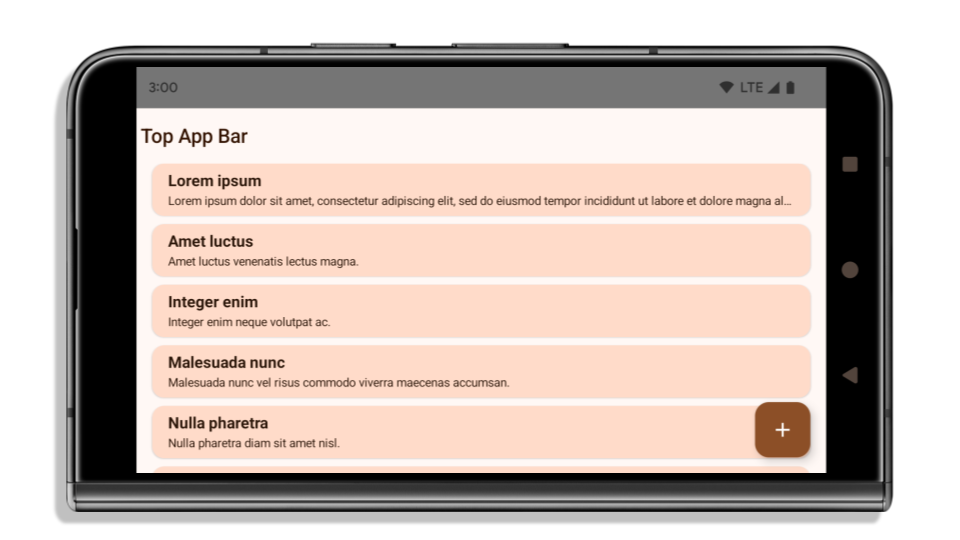
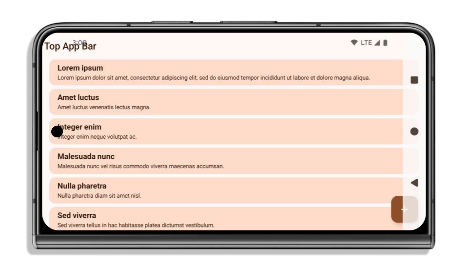
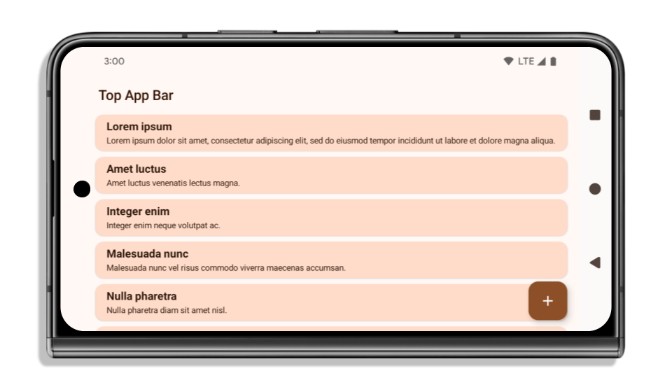

Android 15 (API v35) includes some changes that are intended to create a more consistent, intuitive user experience.

:::note
You can read the official release of this information here: https://developer.android.com/about/versions/15/behavior-changes-15
:::

## Window inset changes

There are two changes related to window insets in Android 15: edge-to-edge is enforced by default, and there are also configuration changes, such as the default configuration of system bars.

### Edge-to-edge enforcement

Apps are edge-to-edge by default on devices running Android 15 if the app is targeting Android 15 (API level 35).


An app that targets Android 14 and is not edge-to-edge on an Android 15 device. The application is contained within the window insets.



After updating your target sdk to 35 you will find that your application is now expected to handle the window insets and is rendered edge-to-edge. However, many elements are now hidden by the status bar, 3-button navigation bar, or display cutout due to the Android 15 edge-to-edge enforcements. 



You will need to update your application to correctly handle rendering within the window insets and render within these bounds so UI elements are not hidden.




### Handling window insets

To get the safe area to render you can use the [Application](https://airnativeextensions.com/extension/com.distriqt.Application) extension to retrieve the display cutout information:

```actionscript
var displayCutout:DisplayCutout = Application.service.display.getDisplayCutout();
```

This object contains 4 properties: `safeInsetBottom`, `safeInsetTop`, `safeInsetLeft`, `safeInsetRight`, each indicating the number of pixels from the edge of the screen that system bars or cutouts may affect.

There is also an `boundingRects` property containing detailed areas for any cutouts that may affect rendering.


You can use this to apply bounds to your root content "safe area", eg using a starling `_safeArea` object for rendering UI elements you can use something like the following :

```actionscript
if (Application.isSupported)
{
    var cutout:DisplayCutout = Application.service.display.getDisplayCutout();
    var topInset:Number = cutout.safeInsetTop / _scale;
    var bottomInset:Number = cutout.safeInsetBottom / _scale;
    var leftInset:Number = cutout.safeInsetLeft / _scale;
    var rightInset:Number = cutout.safeInsetRight / _scale;

    _safeArea.setTo(leftInset, topInset,
        _stageWidth - leftInset - rightInset,
        _stageHeight - topInset - bottomInset);
}
```

:::note
If you use immersive mode or change display modes at any time in your application you should ensure to reapply these corrections afterwards. 
:::


### Cutouts 

If your app targets SDK 35 and is running on an Android 15 device, `LayoutMode.CUTOUT_ALWAYS` is the default behavior. This means that if you were previously relying on setting the LayoutMode eg via calling 

```actionscript
Application.service.display.setDisplayMode( 
    DisplayMode.FULLSCREEN, 
    LayoutMode.CUTOUT_NEVER );
```

this will be interpretted as "always" and your content will be drawn into cutout regions.


### Opt-out

As a temporary workaround you can opt-out of this edge-to-edge enforcement in v35.

:::caution
This option to opt-out will be removed once you update to target v36, so this workaround should only be treated as temporary.
:::

Firstly, create a custom resources folder in your application and package it according to the guide [here](https://airsdk.dev/docs/tutorials/platform/android/custom-resources).

Under your resources folder create a `values-v35` folder and add a file `styles.xml` into this folder with the following content:

```xml title="styles.xml"
<?xml version="1.0" encoding="utf-8"?>
<resources>

    <style name="Theme.NoShadow" parent="android:style/Theme.NoTitleBar">
        <item name="android:windowContentOverlay">@null</item>
        <item name="android:windowOptOutEdgeToEdgeEnforcement">true</item>
    </style>

</resources>
```

The `android:windowOptOutEdgeToEdgeEnforcement` option is the critical one that will disable this edge-to-edge enforcement for Android 35.

