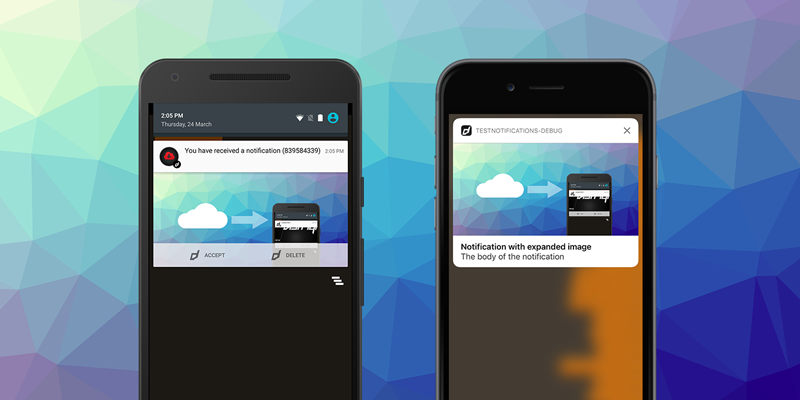

> August Release Roundup: Major updates across several extensions  

This month brings one of the biggest waves of updates we've seen recently, with multiple major version releases, SDK updates, and a few important deprecations to note.  A lot of these updates bring improved compatibility with Android 35 with the major view changes that are required with any app updates now.

This August has been a month of **major foundation upgrades** - from Firebase and Play Services to Media Player and Adverts. While some updates require careful migration (especially Firebase and Game Services), they set developers up with the latest features, improved stability, and compliance with upcoming platform changes.  

If you're using any of these extensions, now is the time to update your projects and plan migrations ahead of deprecations like **Firebase Dynamic Links**.  

<!-- truncate -->

Here's a quick look at the most important updates this month across distriqt extensions:  

:::note Extension Updates
- **Firebase v11.0.0** – Major update: Dynamic Links removed (deprecated by Google). Migration required for email link authentication.  
- **Game Services v11.0.0** – Updated to Google Play Games v2 SDK (v21.0.0). [Migration guide](https://docs.airnativeextensions.com/docs/gameservices/migrating-to-v11.0) available.  
- **Push Notifications v17.0.0** – Latest Firebase Messaging SDKs (Android v25.0.0 / iOS v12.1.0).  
- **Adverts v16.3.0** – AdMob SDK updates (Android v24.5.0 / iOS v12.9.0).  
- **Adverts Mediation v9.0.0** – Latest SDKs for AppLovin, UnityAds, Facebook Audience, IronSource, and more.  
- **Native Maps v7.0.0** – Play Maps SDK v19.2.0 + Android ARMv8 fixes.  
- **Media Player v6.0.0** – Migrated to **AndroidX Media3**, added new video scale modes, and improved background audio support.  
- **Google Identity v8.0.0** – Updated iOS/Android SDKs + new disconnect functionality.  

Biggest change to note: **Firebase Dynamic Links is deprecated and removed**. Projects using email link authentication should migrate immediately.  
:::

Got questions? We're here to help! [Let's build better, faster, and smarter together.](#custom-development-work)

---

### [Firebase](https://airnativeextensions.com/extension/com.distriqt.Firebase)

[Release notes »](https://docs.airnativeextensions.com/docs/firebase/changelog)

This is a **landmark release** for Firebase users:  

- Updated to the latest Firebase SDKs (Android BOM v34.1.0, iOS v12.1.0).  
- **Dynamic Links is deprecated and removed**, following Google's announcement that the service will shut down on **August 25, 2025**. Projects using email link authentication must migrate to the new approach in the updated Auth extension.  
- Improvements across Firestore, Remote Config, Performance Monitoring, and more.  

See the [migration guide](https://docs.airnativeextensions.com/docs/firebase/migrating-to-v11.0) for details.  

---

### [Game Services](https://airnativeextensions.com/extension/com.distriqt.GameServices)

[Release notes »](https://docs.airnativeextensions.com/docs/gameservices/changelog)

The **Game Services extension** has been upgraded to version 11.0.0, featuring support for the latest Google Play Games v2 SDK (v21.0.0). Developers integrating leaderboards, achievements, and game sign-in should review the [migration guide](https://docs.airnativeextensions.com/docs/gameservices/migrating-to-v11.0) to ensure a smooth transition.  

---

### [Push Notifications](https://airnativeextensions.com/extension/com.distriqt.PushNotifications)

[Release notes »](https://docs.airnativeextensions.com/docs/pushnotifications/changelog)

Push notifications has been updated to use the latest **Firebase Messaging SDKs**: Android (v25.0.0) and iOS (v12.1.0). The release also introduces new platform configuration options, giving you more flexibility in tailoring how notifications behave across devices.  

---

### [Application](https://airnativeextensions.com/extension/com.distriqt.Application)

[Release notes »](https://docs.airnativeextensions.com/docs/application/changelog)

A smaller but important iOS fix resolves an issue where **scale values weren't being reflected correctly**. This should improve consistency across devices.  

---

### [Adverts](https://airnativeextensions.com/extension/com.distriqt.Adverts)

[Release notes »](https://docs.airnativeextensions.com/docs/adverts/changelog)

Adverts has been refreshed with the **latest AdMob SDKs** - Android (v24.5.0) and iOS (v12.9.0) - plus updates to the User Messaging Platform (UMP). These updates ensure continued compliance with Google's ad policies and better ad delivery.  

Additionaly the mediation adapters have been refreshed with the **latest ad network SDKs**, including AppLovin, UnityAds, Facebook Audience Network, IronSource, and more. These updates help keep monetisation integrations compliant and efficient.  

---

### [Native Maps](https://airnativeextensions.com/extension/com.distriqt.NativeMaps)

[Release notes »](https://docs.airnativeextensions.com/docs/nativemaps/changelog)

Maps get a boost with the **Play Maps SDK v19.2.0**. This update also resolves an Android issue affecting map visibility on ARMv8 devices - ensuring smoother performance across a wider range of hardware.  

---

### [Media Player](https://airnativeextensions.com/extension/com.distriqt.MediaPlayer)

[Release notes »](https://docs.airnativeextensions.com/docs/mediaplayer/changelog)

The Media Player extension has received a **major overhaul**:  

- Migrated from ExoPlayer to **AndroidX Media3 (v1.8.0)** for improved stability and future-proofing.  
- New **video scale modes** (fit, fill, zoom).  
- Better support for background audio and remote command controls.  
- Enhanced player interactions with new mouse/touch event dispatching.  

This release significantly improves flexibility for video playback in apps and games.  

---

### [Google Identity](https://airnativeextensions.com/extension/com.distriqt.GoogleIdentity)

[Release notes »](https://docs.airnativeextensions.com/docs/googleidentity/changelog)

Identity handling is sharper than ever:  

- Updated to **iOS SDK v9.0.0** and Play Services Auth v21.4.0.  
- New disconnect functionality using `revokeAccess`.  
- Documentation fixes clarify Firebase Core dependencies.  

---

## Custom Development Work

We've been lucky to work with some amazing clients this year - helping them push their apps further with AIR, native, Flutter, Unity, and Haxe.

If you've got a tricky integration, a performance challenge, or just need expert help, we're here for it. We specialize in high-performance native extensions and making complex systems work together seamlessly.

📩 Got a project in mind? Reach out at [airnativeextensions@distriqt.com](mailto:airnativeextensions@distriqt.com).

Let's build something great together!