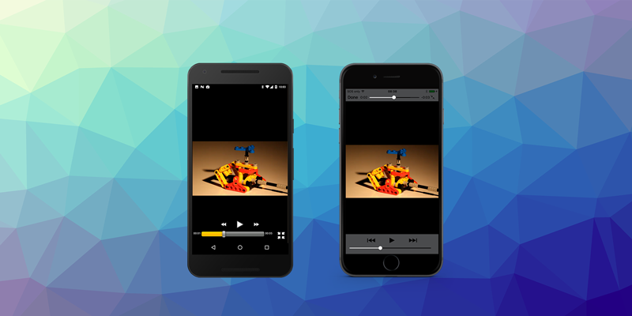

> September Release Roundup: Android 15 & iOS 26 Compatibility   

Great news for all our developers! This month brings critical updates across our extension portfolio to ensure compatibility with Android 15 (API 35) and iOS 26, along with exciting new features to enhance your applications.

<!-- truncate -->

Here's a quick overview of our latest extension updates:

:::note Extension Updates
- [Adverts v16.4.0](https://github.com/distriqt/ANE-Adverts/releases/tag/v16.4.0) - Android 15 & iOS 26 compatibility updates
- [InAppBilling v18.0.0](https://github.com/distriqt/ANE-InAppBilling/releases/tag/v18.0.2) - **Major Update** to Play Billing v8 + macOS compatibility fix
- [Location v6.1.0](https://github.com/distriqt/ANE-Location/releases/tag/v6.1.0) - **Major Update** with rebuilt Android implementation
- [Scanner v6.0.6](https://github.com/distriqt/ANE-Scanner/releases/tag/v6.0.6) - **Major Update** with completely rewritten scanning algorithm + Android 15 system bars and cutouts fix
- [BranchIO v5.20.100](https://github.com/airnativeextensions/ANE-BranchIO/releases/tag/v5.20.100) - Updated SDKs and modernized integration
- [Singular v13.1.0](https://github.com/airnativeextensions/ANE-Singular/releases/tag/v13.1.0) - SDK updates: Android v12.10.0, iOS v12.8.1
- [MediaPlayer v6.0.2](https://github.com/distriqt/ANE-MediaPlayer/releases/tag/v6.0.2) - Improved iOS background audio handling
- [AudioRecorder v4.0.0](https://github.com/airnativeextensions/ANE-AudioRecorder/releases/tag/v4.0.0) - Updated dependencies and permission handling
- [GameServices v11.0.1](https://github.com/distriqt/ANE-GameServices/releases/tag/v11.0.1) - Fixed macOS Game Center crash
- [PushNotifications v17.0.1](https://github.com/distriqt/ANE-PushNotifications/releases/tag/v17.0.1) - Updated OneSignal SDKs
- [Core v7.5.5](https://github.com/distriqt/ANE-Core/releases/tag/v7.5.5) - Updated for macOS 10.13 minimum and latest Xcode
- [Google Play Services v32.0.1](https://github.com/distriqt/ANE-GooglePlayServices/releases/tag/v32.0.1) - AdMob SDK updated to v24.6.0
:::

Got questions? We're here to help! [Let's build better, faster, and smarter together.](#custom-development-work)

---

### [InAppBilling](https://airnativeextensions.com/extension/com.distriqt.InAppBilling)

[Release notes »](https://docs.airnativeextensions.com/docs/inappbilling/changelog)

This update to Play Billing v8 changes the purchases returned via `getPurchases` / `restorePurchases`. 
This used to return all historical purchases. Now it will only return active purchases and you are 
expected to track historical purchases yourself or use the server API.

[Recommendations](https://developer.android.com/google/play/billing/query-purchase-history):
 - Handle Voided Purchases: To fetch voided or cancelled purchases, use the [voided purchases](https://developers.google.com/android-publisher/voided-purchases) server developer API.
 - Track Historical Purchases: If your app would like to track a user's purchase history your app should keep track of the history on your apps backend.

This update also includes an update to the Amazon Appstore integration, bringing the latest SDK and bug fixes.

#### Updates

- feat(playbilling): update playbilling sdk v8.0.0 
- feat(amazon): update amazon appstore sdk v3.0.8 
- feat(macos): correct minimum macos version to 10.13

:::caution
**Critical change alert**: With Play Billing v8, `getPurchases` and `restorePurchases` now return only active purchases, not historical ones.
If you require historical transactions you should now track purchase history on your backend and use server APIs for voided/cancelled purchases.
:::

---

### [Scanner](https://airnativeextensions.com/extension/com.distriqt.Scanner)

[Release notes »](https://docs.airnativeextensions.com/docs/scanner/changelog)

Major performance boost! We've completely rewritten the scanning algorithm:

- Replaced aging ZBar with modern MLKit (Android) and Vision framework (iOS)
- Improved permission handling for Android API 34
- New asynchronous bitmap scanning for large images
- Enhanced focus implementation for more reliable scanning
- Adds proper handling of system bars and cutouts on Android 15 for a seamless user experience.

---

### [Location](https://airnativeextensions.com/extension/com.distriqt.Location)

[Release notes »](https://docs.airnativeextensions.com/docs/location/changelog)

Reliability upgrade: The Android implementation has been completely rewritten with the latest Google Play Services:

- Brand new geofencing implementation
- Improved location service for reliable background and persistent updates
- Fixed foreground service permissions and notifications

---

### [MediaPlayer](https://airnativeextensions.com/extension/com.distriqt.MediaPlayer)

[Release notes »](https://docs.airnativeextensions.com/docs/mediaplayer/changelog)

Improved background audio player implementation for iOS to minimize impact on AIR sounds, ensuring your app's audio experience remains seamless.

---

### [AudioRecorder](https://airnativeextensions.com/extension/com.distriqt.AudioRecorder)

[Release notes »](https://docs.airnativeextensions.com/docs/audiorecorder/changelog)

The complete update includes:

- Corrected required permissions for recent Android API versions
- Updated for latest Xcode compatibility
- Improved documentation for playback and installation

---

### [GameServices](https://airnativeextensions.com/extension/com.distriqt.GameServices)

[Release notes »](https://docs.airnativeextensions.com/docs/gameservices/changelog)

Fixed a potentially serious issue with playerID retrieval from Game Center that could cause crashes on macOS.

---

### [PushNotifications](https://airnativeextensions.com/extension/com.distriqt.PushNotifications)

[Release notes »](https://docs.airnativeextensions.com/docs/pushnotifications/changelog)

- OneSignal SDK updates: Android v5.1.37, iOS v5.2.14
- Improved documentation for OneSignal Amazon manual integration

---

### [Adverts](https://airnativeextensions.com/extension/com.distriqt.Adverts)

[Release notes »](https://docs.airnativeextensions.com/docs/adverts/changelog)

Edge-to-Edge Display issue has been on going and Google have claimed to have fixed the issue in the latest release, however we are still having users report issues with the fix so it seems that there is further work to be done by the Admob team at Google to fix the Android 35 issue. We will keep you updated with any news.

#### What's new:

- Updated AdMob SDKs (Android v24.6.0, iOS v12.11.0)
- Additional positioning checks after ad load
- Improved audio handling for iOS implementations

> "The iOS update includes support for iOS 26 and significantly improved sound handling that should resolve several reported audio issues."

--- 

### [BranchIO](https://airnativeextensions.com/extension/io.branch.nativeExtensions.Branch)

[Release notes »](https://docs.airnativeextensions.com/docs/branch/changelog)

We've completely modernized the BranchIO implementation with:

- Android SDK v5.20.1 with streamlined Gradle dependencies
- iOS SDK v3.13.1 implementation now using XCFramework
- Simplified ActionScript API with clear deprecation markings

---

### [Singular](https://github.com/airnativeextensions/ANE-Singular)

[Release notes »](https://docs.airnativeextensions.com/docs/singular/changelog)

Track user behavior with greater accuracy using updated SDKs:

- Android SDK v12.10.0
- iOS SDK v12.8.1

---

## Custom Development Work

Got a tricky integration? Wrestling with performance? Or just looking for a team who knows how to make complex systems click? That's our sweet spot. We're experts in high-performance native extensions and seamless integrations that make your apps shine.

Let's make it happen: airnativeextensions@distriqt.com.

Here's to building the next wave of amazing app experiences!