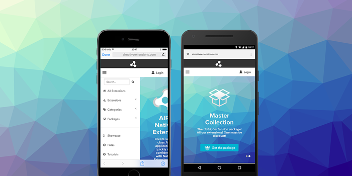

> October Release Roundup

This month we’ve released a range of updates focusing on macOS compatibility, Android 15 edge-to-edge improvements, and major SDK updates across Adverts, Facebook, and mediation extensions.

These updates continue our commitment to keeping all ANEs stable, modern, and aligned with the latest platform changes from Google and Apple.

<!-- truncate -->

Here's a quick overview of our latest extension updates:

:::note Extension Updates
- [GameServices v11.0.2](https://github.com/distriqt/ANE-GameServices/releases/tag/v11.0.2) - Fixed macOS compatibility issue
- [InAppBilling v18.0.3](https://github.com/distriqt/ANE-InAppBilling/releases/tag/v18.0.3) - Fixed macOS compatibility issue
- [Adverts v16.5.0](https://github.com/distriqt/ANE-Adverts/releases/tag/v16.5.0) - Android 15 & iOS 26 compatibility updates
- [Native WebView v8.0.1](https://github.com/distriqt/ANE-NativeWebView/releases/tag/v8.0.1) - Fixed null exception when WebView
- [Facebook v18.1.0](https://github.com/distriqt/ANE-FacebookAPI/releases/tag/v18.1.0) - Updated SDKs
:::

Got questions? We're here to help! 

--- 

### New Tutorial: iOS Packaging on Windows

If you’re developing AIR apps on Windows and need to build for iOS, check out our new [guide](https://airsdk.dev/docs/tutorials/platform/ios/windows-packaging) on how to package iOS applications using Windows.

Packaging iOS applications on Windows is not supported by Apple, however, the AIR SDK has been able to get around this for a long time by creating stubs of the iOS SDK and using a specially packaged version of the open source Apple linker.

This tutorial goes through some additional configuration that you may need to do in order to get extensions packaging and linking correctly on Windows. 

Read the tutorial here: https://airsdk.dev/docs/tutorials/platform/ios/windows-packaging

--- 

### Display

The Display extension is a new extension I'm working on to address the aging display modes and keyboard integration in the [Application extension](https://github.com/airsdk/Adobe-Runtime-Support/discussions/3947). 

This new extension aims to use the more modern approach around managing display modes and monitoring the keyboard. Currently I have it working on the majority of cases but as with anything associated with Android there are a lot of edge cases that need to be addressed and handled in the code. I'm currently working through as many of these as I find.

:::info
If you are interested in helping me test this new extension, please reach out! I'd appreciate your involvement and help in identifying edge cases. 
:::

---

### [GameServices](https://airnativeextensions.com/extension/com.distriqt.GameServices)

[Release notes »](https://docs.airnativeextensions.com/docs/gameservices/changelog)

#### What's new:

- Fixed a [compatibility issue with macOS](https://github.com/distriqt/ANE-GameServices/issues/252) where we had inadvertently increased the minimum macOS version. 

---

### [InAppBilling](https://airnativeextensions.com/extension/com.distriqt.InAppBilling)

[Release notes »](https://docs.airnativeextensions.com/docs/inappbilling/changelog)

#### What's new:

- Fixed a [compatibility issue with macOS](https://github.com/distriqt/ANE-InAppBilling/issues/660) where we had inadvertently increased the minimum macOS version. 

---

### [Adverts](https://airnativeextensions.com/extension/com.distriqt.Adverts)

[Release notes »](https://docs.airnativeextensions.com/docs/adverts/changelog)

We believe this release finally resolves the issues encountered with edge-to-edge displays on Android 15+. Please note that this requires changes if you are using the Application extension to set display modes.

#### What's new:

- Fixed immersive mode detection issues affecting Android 15 (API 35) and edge-to-edge displays
- Updated AdMob SDK → v24.7.0 (Android) and v12.12.0 (iOS)
- SDK updates across all major mediation networks
	- Added GDPR and CCPA consent support for Pangle
	- AppLovin: v13.4.0
	- IronSource: v9.0.0
	- UnityAds: v4.16.2
	- Facebook Audience: v6.20.0.1
	- DigitalTurbine: v8.4.0
	- Vungle: v7.6.0

> If you use the Application extension for display mode control, contact support for required changes.

---

### [Native WebView](https://airnativeextensions.com/extension/com.distriqt.NativeWebView)

[Release notes »](https://docs.airnativeextensions.com/docs/nativewebview/changelog)

#### What's new:

- Fixed null exception when WebView destroyed during load [#351](https://github.com/distriqt/ANE-NativeWebView/issues/351)

---

### [Facebook](https://airnativeextensions.com/extension/com.distriqt.FacebookAPI)

[Release notes »](https://docs.airnativeextensions.com/docs/facebookapi/changelog)

#### What's new:

- Updated iOS SDK → v18.0.1 
- Updated Android SDK → v18.1.3
- Updated to Android target SDK 35

--- 

## Thanks for your support

As always, thank you for your continued support of distriqt and the AIR developer community.
Your feedback and contributions help us keep these extensions up to date and running smoothly across platforms.

- For full documentation and setup guides, visit [docs.airnativeextensions.com](https://docs.airnativeextensions.com)
- Join the AIR community discussions and get support at [github](https://github.com/airsdk/Adobe-Runtime-Support/) 
- [Support](https://github.com/sponsors/marchbold) my ongoing involvement in the community 

Stay tuned for more updates next month!