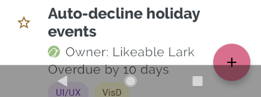
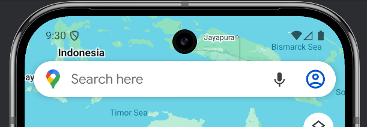
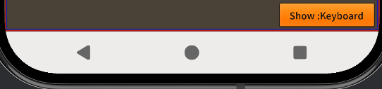

Edge-to-edge layouts means that the window spans the entire width and height of the display by drawing behind the system bars including the status bar, caption bar, and navigation bar.

This means that your content may render behind operating system elements and you will need to account for this in the design and execution of your application. 
You will likely want to render certain content under the system UI, such as scrolling and non-UI elements however it is important that your interactive elements never get rendered in these areas. 

For example in the following a button is obscured by the navigation bar:

| Obscured | Correctly Rendered | 
| --- | --- | 
|  |  |

Using the methods here you will be able to correctly implement these solutions in your application.

{/* truncate */}


## Display Extension

To help with managing edge-to-edge displays the [Display](https://airnativeextensions.com/extension/com.distriqt.Display) extension provides APIs to help you manage safe areas and window insets.

We have recently created the Display extension, which separates the functionality previously found the the [Application](https://airnativeextensions.com/extension/com.distriqt.Application) extension and improves upon it to better support safe areas and window insets.

The Display extension provides:
- Control the display mode of your application (immersive, fullscreen or normal)
- Access to the safe area insets on iOS devices
- Access to the window insets on Android devices
- Cutouts (notches) on Android devices
- Status and navigation bar style 

[Install this extension](https://docs.airnativeextensions.com/docs/display/) into your application before proceeding with the steps below.


## Getting Safe Area

The safe area represents the area of the screen that is guaranteed to be unobstructed by system UI elements.

To access this call `getSafeArea()` on the `windowInsets` property of the `Display` singleton instance:

```actionscript
var safeArea:Insets = Display.instance.windowInsets.getSafeArea();
```

The `Insets` object returned contains the safe area insets (i.e. required padding) for each side of the display in pixels. 

- `safeArea.top` - The inset from the top of the display
- `safeArea.left` - The inset from the left of the display
- `safeArea.right` - The inset from the right of the display
- `safeArea.bottom` - The inset from the bottom of the display

You can then use these values to position your interactive elements within the safe area of the display.


## Applying Safe Area

To apply the safe area insets to your application layout you can use the values from the `Insets` object to adjust the position of your interactive elements.

> 
> Applying the safe area will depend on your application layout and framework but generally you will want to add padding to the edges of your layout equal to the safe area insets.
>  

For example to position a button in the top left of the safe area you could do the following:

```actionscript
var safeArea:Insets = Display.instance.windowInsets.getSafeArea();
myButton.x = safeArea.left + desiredPadding;
myButton.y = safeArea.top + desiredPadding;
```

### Using a Container

I highly recommend adding a container for your UI elements and applying the safe area insets to that container so that all child elements are positioned correctly. 

For example if you are using Feathers UI in a Starling application you could do the following:

```actionscript
// Create a container for UI elements
var uiContainer:LayoutGroup = new LayoutGroup();
uiContainer.width = Starling.current.stage.stageWidth;
uiContainer.height = Starling.current.stage.stageHeight;
addChild( uiContainer );


// Apply the safe area insets
var safeArea:Insets = Display.instance.windowInsets.getSafeArea();
var safeAreaScaled:Insets = safeArea.scale( 1 / Starling.contentScaleFactor );

var layout:VerticalLayout = new VerticalLayout();
layout.paddingTop = safeAreaScaled.top;
layout.paddingLeft = safeAreaScaled.left;
layout.paddingRight = safeAreaScaled.right;
layout.paddingBottom = safeAreaScaled.bottom;

uiContainer.layout = layout;
```


## Status and Navigation Bars

You will likely want to draw behind the system status and navigation bars while still allowing user interaction with them. 



The default mode for these with AIR is a solid background which doesn't really fit with modern Android UI design.


The suggested approach is to set the status and navigation bars to be transparent so that your application can be seen behind them.
If you want a solid colour you can simply add a rectangle behind them in your application design, or alternatively you can 
render your content behind them for a more immersive experience.

You can use the Display extension to set the status bar style. This call sets the status bar to have light icons and a transparent background with recent versions of Android:

```actionscript
Display.instance.setStatusBarStyle( StatusBarStyle.LIGHT );
```

| Light Status Bar | Dark Status Bar | 
| --- | --- | 
|  |  |


Simlarly you can set the navigation bar style:

```actionscript
Display.instance.setNavigationBarStyle( NavigationBarStyle.LIGHT );
```

| Light Navigation Bar | Dark Navigation Bar | 
| --- | --- | 
|  |  |


:::note 
The navigation bar style is only relevant when the user has selected to use button navigation rather than gesture navigation on their device.
Gesture navigation displays a small bar at the bottom of the screen which reflects the system dark mode theme setting.
:::

## Best Results 

To get the best results when managing edge-to-edge displays, consider the following tips:

- Set your application not to use full screen mode in the application descriptor. This allows the extension to manage the layout of your application correctly.
    ```xml
    <fullScreen>false</fullScreen>
    ```

- Set the display mode to match your needs, generally we recommend `DisplayMode.NORMAL` to allow your application to draw behind the system bars while still allowing user interaction with them.

    ```actionscript
    Display.instance.setDisplayMode( DisplayMode.NORMAL );
    ```

- Set the status bar style to match your application design. For example, if your application has a dark background, you may want to set the status bar style to light:

    ```actionscript
    Display.instance.setStatusBarStyle( StatusBarStyle.LIGHT );
    ```

- Create a container for your UI and apply the safe area insets to your layout to ensure that interactive elements are not obscured by system UI elements.

- If you plan to support dark mode you can use the `userInterfaceStyle` property of the `Display` instance to determine the current system theme and adjust your application design accordingly.

    ```actionscript
    if (Display.instance.userInterfaceStyle == UserInterfaceStyle.DARK)
    {
        // Apply dark mode design
    }
    else
    {
        // Apply light mode design
    }
    ```


