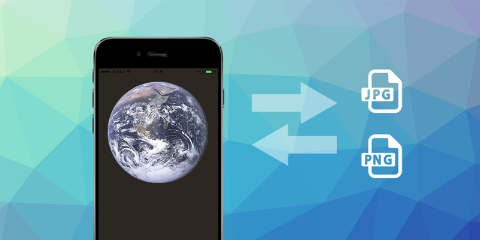

:::tip Welcome to 2026! 

As we step into the new year, I'd like to warmly thank all of my clients and the community for your support throughout 2025. Your continued support makes my contribution to the AIR community possible and I really do hope it is valuable to your applications. I'm incredibly excited about what's ahead in 2026, with new extensions on the horizon and continued improvements across our extensions. 

December has been a particularly busy month, with new features, important fixes, and several new beta and initial releases. Your issue reports, beta testing, and discussions have played a direct role in shaping these improvements, and I'm incredibly grateful for that collaboration.

I hope you're all able to enjoy a well-earned New Year break, and I'm excited to kick off 2026 with even more momentum. There's a lot planned, and I look forward to continuing to build powerful, reliable tools together in the year ahead.

Wishing you a relaxing break and an exciting start to 2026.

If you have a project in mind and are looking for development support, please don't hesitate to reach out. I'm excited to kick off new projects in 2026 and [would love to chat](mailto:ma@distriqt.com).

Happy coding!
:::

<!-- truncate -->

Here's a quick overview of the latest extension updates:

:::note Extension Updates
- [Image v7.1.0](https://github.com/distriqt/ANE-Image/releases/tag/v7.1.0) - Screenshot capture improvements
- [NativeWebView v8.0.2](https://github.com/distriqt/ANE-NativeWebView/releases/tag/v8.0.2) - Disable the iOS input accessory view
- [AgeRange v0.0.4](https://github.com/airnativeextensions/ANE-AgeRange/releases/tag/v0.0.4) - Further updates to the beta release for new age related SDKs
- [Display v0.0.4](https://github.com/airnativeextensions/ANE-Display/releases/tag/v0.0.4) - Beta release of the new Display extension
:::

If you have any questions or want to get involved in testing, we're here to help!


--- 



### [Image](https://airnativeextensions.com/extension/com.distriqt.Image)

[v7.1.0](https://github.com/distriqt/ANE-Image/releases/tag/v7.1.0)

This release focuses on improving screenshot capture on Android, including stability fixes for newer OS versions. It significantly improves reliability for apps that rely on automated or background screenshot capture.

#### Updates 
- New Android screenshot capture API: Capture the application view without user interaction, making it easier to programmatically generate screenshots.
- Crash fixes on newer Android versions: Resolves issues related to Media Projection when capturing the full screen.

--- 


### [NativeWebView](https://airnativeextensions.com/extension/com.distriqt.NativeWebView)

[v8.0.2](https://github.com/distriqt/ANE-NativeWebView/releases/tag/v8.0.2)

A small but highly requested improvement for apps embedding complex web experiences.

#### Updates
- Disable the iOS input accessory view: Developers can now hide the default input accessory bar above the keyboard, giving greater control over UI and UX in web-based forms.


---


### [AgeRange](https://docs.airnativeextensions.com/docs/agerange/)

[v0.0.4](https://github.com/airnativeextensions/ANE-AgeRange/releases/tag/v0.0.4)

:::info
This is a new extension that is available for free thanks to my [sponsors](https://github.com/sponsors/marchbold). I am looking for anyone interested in testing the extension and welcoming any feedback. Please note that the extension and the underlying SDKs are all still flagged as beta.
:::

This extension is quickly maturing and is now much easier to test and integrate safely.

Available now [here](https://github.com/airnativeextensions/ANE-AgeRange)  or via apm:

```bash
apm install com.distriqt.AgeRange
```

#### Updates 
- Check regional eligibility (iOS): A new `isEligibleForAgeRange` API lets you determine whether a user's region is subject to age range controls.
- Updated Play Signals API (Android): Android integration updated to Play Signals API v0.0.2.
- Testing support with fake results: Both platforms now support fake/test results, making development and QA significantly easier.
- Defined error codes: Common failure cases are now clearly defined and surfaced.
- Documentation fixes: ASDocs generation issues resolved.


--- 


### [Display](https://airnativeextensions.com/extension/com.distriqt.Display)

[v0.0.4](https://github.com/airnativeextensions/ANE-Display/releases/tag/v0.0.4)

The Display extension is a new extension I'm working on to address the aging display modes and keyboard integration in the [Application extension](https://github.com/airsdk/Adobe-Runtime-Support/discussions/3947). 

This new extension aims to use the more modern approach around managing display modes and monitoring the keyboard. Currently I have it working on the majority of cases but as with anything associated with Android there are a lot of edge cases that need to be addressed and handled in the code. I'm currently working through as many of these as I find.

:::info
This marks the first beta of the Display ANE, laying the groundwork for future display and screen-related functionality. Feedback during this phase will help shape its direction.
:::

#### Updates 
- Initial beta release 


---


## Further Information

As always, thank you for your continued support of distriqt and the AIR developer community.
Your feedback and contributions help us keep these extensions up to date and running smoothly across platforms.

- For full documentation and setup guides, visit [docs.airnativeextensions.com](https://docs.airnativeextensions.com)
- Join the AIR community discussions and get support at [github](https://github.com/airsdk/Adobe-Runtime-Support/) 
- Publicly available extensions at [airnativeextensions](https://github.com/airnativeextensions)
- [Support](https://github.com/sponsors/marchbold) my ongoing involvement in the community 

Stay tuned for more updates next month!