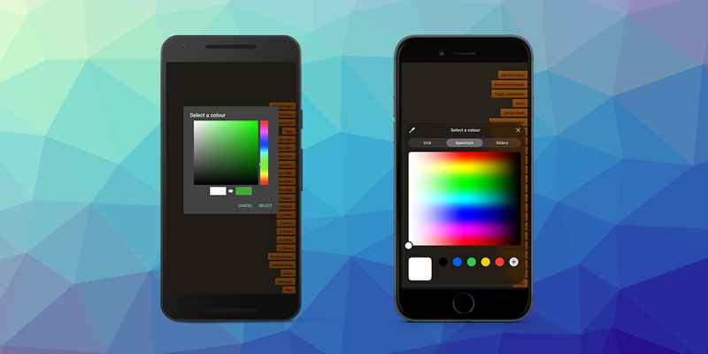

> February Release Update

It has been a busy month for the AIR development ecosystem! The February releases focus heavily on modernizing core SDKs—specifically Firebase v12.9.0 and AdMob v24.9.0 - while introducing some highly requested UI features and critical stability fixes. 

Key focus:

- Keeping all Firebase and Google SDKs fully up to date
- Aligning AdMob and mediation networks with the latest versions
- Improving consent management and monetisation reporting
- Fixing packaging and manifest generation issues
- Introducing new UI capabilities like the colour picker dialog

As always, we recommend updating to the latest versions to ensure compliance, stability, and access to new features.

<!-- truncate -->

Here's a quick overview of the latest extension updates:

:::note Extension Updates
- [Dialog v9.1.0](https://github.com/distriqt/ANE-Dialog/releases/tag/v9.1.0) - Added native Colour Picker
- [Adverts v17.0.0](https://github.com/distriqt/ANE-Adverts/releases/tag/v17.0.0) - AdMob v24.9.0 + Consent Sync
- [Firebase v12.0.0](https://github.com/distriqt/ANE-Firebase/releases/tag/v12.0.0) - SDK v12.9.0 (iOS) / BOM v34.9.0 (Android).
- [GoogleIdentity v8.1.0](https://github.com/distriqt/ANE-GoogleIdentity/releases/tag/v8.1.0) - Latest Google Sign-In SDK support
- [GooglePlayServices v32.1.4](https://github.com/distriqt/ANE-GooglePlayServices/releases/tag/v32.1.4) - Fixes for apm manifest generation
:::

If you have any questions, we're here to help!

--- 

### [Dialog](https://airnativeextensions.com/extension/com.distriqt.Dialog)

[v9.1.0](https://github.com/distriqt/ANE-Dialog/releases/tag/v9.1.0)

One of the most exciting additions this month is the new Colour Picker dialog in the Dialog extension (v9.1.0). You can now provide a native interface for users to select colors on both iOS and Android, streamlining the UI for creative or customization-focused apps.

#### Key Features 
- The colour picker dialog presents a UI that allows the user to select a colour on a spectrum. 
- Allows control of the initial colour
- Supports alpha channel input

--- 

### [Adverts](https://airnativeextensions.com/extension/com.distriqt.Adverts)

[v17.0.0](https://github.com/distriqt/ANE-Adverts/releases/tag/v17.0.0)

A major update for Adverts brings it fully up to date with the latest advertising SDKs:

- Android: v24.9.0
- iOS: v13.0.0

This release ensures compliance, improved monetisation insights, and compatibility with the latest ad platform requirements.

#### Updates 
- Updated to latest AdMob SDK
- Updated UMP (User Messaging Platform)
- New Consent Sync ID – Sync consent settings across apps from the same developer
- Enhanced PaidEvent – Now includes detailed response info for improved revenue tracking and diagnostics

#### Mediation Networks

All major mediation networks have been upgraded to their latest compatible SDKs, including:

- AppLovin
- Digital Turbine
- Facebook Audience Network
- ironSource
- Mintegral
- Pangle
- Unity Ads
- Vungle

This ensures optimal fill rates, stability, and compliance across mediation partners.

--- 

### [Firebase](https://airnativeextensions.com/extension/com.distriqt.Firebase)

[v12.0.0](https://github.com/distriqt/ANE-Firebase/releases/tag/v12.0.0)

The Firebase extensions have been updated to the latest Firebase SDKs:

- iOS SDK v12.9.0
- Android BOM v34.9.0

This release keeps your apps aligned with current Firebase platform changes while adding important authentication improvements.

#### Updates 
- Added `verifyBeforeUpdateEmail`
- Deprecated `updateEmail`
- Updates across Auth, Crashlytics, Firestore, Database, Performance, RemoteConfig, and Storage

--- 

### [GoogleIdentity](https://airnativeextensions.com/extension/com.distriqt.GoogleIdentity)

[v8.1.0](https://github.com/distriqt/ANE-GoogleIdentity/releases/tag/v8.1.0)

The GoogleIdentity extension now supports the latest Google Identity SDKs:
- Android Google Identity SDK v1.2.0
- iOS Google Sign-In SDK v9.1.0

Ensuring continued compatibility with modern Google authentication flows.

---

## Further Information

As always, thank you for your continued support of distriqt and the AIR developer community.
Your feedback and contributions help us keep these extensions up to date and running smoothly across platforms.

- For full documentation and setup guides, visit [docs.airnativeextensions.com](https://docs.airnativeextensions.com)
- Join the AIR community discussions and get support at [github](https://github.com/airsdk/Adobe-Runtime-Support/) 
- Publicly available extensions at [airnativeextensions](https://github.com/airnativeextensions)
- [Support](https://github.com/sponsors/marchbold) my ongoing involvement in the community 

Stay tuned for more updates next month!