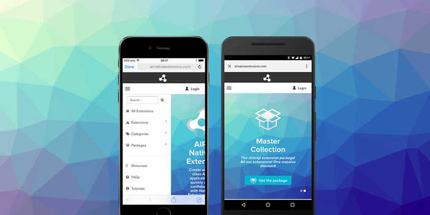

> March Release Update

March brought a focused set of extension updates with important SDK upgrades, stability fixes, and testing improvements across billing, social login, web views, and age signal support.

Key focus:

- Updating Google Play Billing to the latest supported version
- Keeping Facebook iOS SDK integrations current
- Resolving a macOS NativeWebView crash scenario
- Expanding AgeRange testing and handling paths for edge cases

As always, we recommend updating to the latest versions to ensure compatibility, stability, and access to the newest platform features.

<!-- truncate -->

Here's a quick overview of the latest extension updates:

:::note Extension Updates
- [InAppBilling v18.1.0](https://github.com/distriqt/ANE-InAppBilling/releases/tag/v18.1.0) - Play Billing SDK v8.3.0 and `countryCode` support in `getUserData`
- [FacebookAPI v18.1.1](https://github.com/distriqt/ANE-FacebookAPI/releases/tag/v18.1.1) - iOS SDK update to v18.0.3
- [NativeWebView v8.0.5](https://github.com/distriqt/ANE-NativeWebView/releases/tag/v8.0.5) - macOS focus-loss crash fix
- [AgeRange v0.3.0](https://github.com/airnativeextensions/ANE-AgeRange/releases/tag/v0.3.0) - Null handling, fake error testing, and packaging fixes
- [AgeRange v0.2.0](https://github.com/airnativeextensions/ANE-AgeRange/releases/tag/v0.2.0) - Play Age Signals API v0.0.3 updates
:::

If you have any questions, we're here to help!

---

### [InAppBilling](https://airnativeextensions.com/extension/com.distriqt.InAppBilling)

[v18.1.0](https://github.com/distriqt/ANE-InAppBilling/releases/tag/v18.1.0)

This release updates Google Play Billing and improves user data support across platforms.

#### Updates
- Android: Updated Play Billing SDK to v8.3.0
- Android and iOS: Added `countryCode` to `getUserData` functionality

---

### [FacebookAPI](https://airnativeextensions.com/extension/com.distriqt.FacebookAPI)

[v18.1.1](https://github.com/distriqt/ANE-FacebookAPI/releases/tag/v18.1.1)

This update keeps the iOS Facebook integration current and aligned with the latest SDK release.

#### Updates
- iOS SDK updated to v18.0.3

---

### [NativeWebView](https://airnativeextensions.com/extension/com.distriqt.NativeWebView)

[v8.0.5](https://github.com/distriqt/ANE-NativeWebView/releases/tag/v8.0.5)

This release addresses a macOS stability issue seen in specific focus-change situations.

#### Updates
- macOS: Fixed a crash when WebView loses focus in particular situations

---

### [AgeRange](https://docs.airnativeextensions.com/docs/agerange/)

[v0.3.0](https://github.com/airnativeextensions/ANE-AgeRange/releases/tag/v0.3.0)

AgeRange v0.3.0 improves reliability and testing support around user status and error simulation.
The previous release (v0.2.0) updated the Play Age Signals API integration and introduced support for the new `SELF_DECLARED` status and `SDK_VERSION_OUTDATED` error handling path.

#### Updates
- Android: Handle `null` values for user status in both normal and fake result paths
- Android: Added ability to set fake error values for testing
- iOS: Added ability to set fake error values for testing
- AirPackage: Corrected dependencies and package metadata
- Android: Updated Play Age Signals API to v0.0.3

---

## Further Information

As always, thank you for your continued support of distriqt and the AIR developer community.
Your feedback and contributions help us keep these extensions up to date and running smoothly across platforms.

- For full documentation and setup guides, visit [docs.airnativeextensions.com](https://docs.airnativeextensions.com)
- Join the AIR community discussions and get support at [github](https://github.com/airsdk/Adobe-Runtime-Support/)
- Publicly available extensions at [airnativeextensions](https://github.com/airnativeextensions)
- [Support](https://github.com/sponsors/marchbold) my ongoing involvement in the community

Stay tuned for more updates next month!