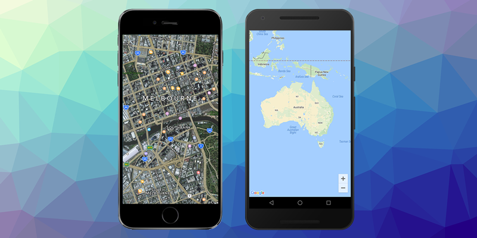
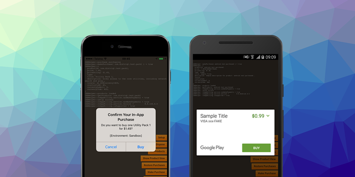

> May brought platform expansion and new feature releases

May includes major platform updates, performance improvements, and the launch of a new analytics extension.

Key focus:

- Windows platform support added to Location extension with geocoding and distance utilities
- Performance improvements for Android with background thread compatibility in NativeMaps
- New storage features in CloudStorage with document metadata and error handling
- Launch of GameAnalytics extension for in-game analytics


:::info Important Notice: Location v7.0.0 Windows Geocoding
The new Windows implementation for Location v7.0.0 includes geocoding support, which requires an Azure Maps token.

To use geocoding features on Windows, you'll need to set your Azure Maps service token:

- See the [Geocoder.setServiceToken()](https://docs.airnativeextensions.com/docs/location/geocoding) method documentation for setup details
- Visit [Azure Maps documentation](https://docs.microsoft.com/en-us/azure/azure-maps/) for token generation
:::


<!-- truncate -->

Here's a quick overview of the latest extension updates:

:::note Extension Updates
- [Location v7.0.0](https://github.com/airnativeextensions/ANE-Location/releases/tag/v7.0.0) - Major update adding Windows implementation with location updates, geocoding, and distance utilities
- [CloudStorage v7.1.0](https://github.com/airnativeextensions/ANE-CloudStorage/releases/tag/v7.1.0) - Document metadata and storage full event handling
- [NativeMaps v7.1.0](https://github.com/airnativeextensions/ANE-NativeMaps/releases/tag/v7.1.0) - Background thread compatibility for improved Android performance
- [GameAnalytics v1.0.0](https://github.com/airnativeextensions/ANE-GameAnalytics/releases/tag/v1.0.0) - Initial release of game analytics extension
- [InAppBilling v18.1.2](https://github.com/airnativeextensions/ANE-InAppBilling/releases/tag/v18.1.2) - Documentation and stability updates
:::

If you have any questions, we're here to help!


---


### [Location](https://airnativeextensions.com/extension/com.distriqt.Location)

[v7.0.0](https://github.com/airnativeextensions/ANE-Location/releases/tag/v7.0.0)

Major update adding full Windows platform support with location updates, geocoding utilities, and distance calculations. Geofences are not supported in this release.

#### Updates
- Windows: Added location updates support
- Windows: Added geocoding utilities support (requires Azure Maps token)
- Windows: Added distance utilities support
- Android Library: Updated to v21.3.0


---


### [CloudStorage](https://airnativeextensions.com/extension/com.distriqt.CloudStorage)

[v7.1.0](https://github.com/airnativeextensions/ANE-CloudStorage/releases/tag/v7.1.0)

Enhanced document storage with metadata tracking and improved error handling for storage full conditions.

#### Updates
- iOS: Added document metadata processing (download status, storage status)
- iOS: Added storage full event handling
- Improved error reporting when cloud storage is full

#### Code Example

Handle storage-full errors from the document store:

```actionscript
import com.distriqt.extension.cloudstorage.CloudStorage;
import com.distriqt.extension.cloudstorage.events.DocumentStoreEvent;

CloudStorage.service.documentStore.addEventListener( DocumentStoreEvent.ERROR, onStoreError );

function onStoreError( event:DocumentStoreEvent ):void
{
    if (event.errorCode == "STORAGE_FULL")
    {
        trace( "Cloud storage is full" );
    }
}
```

More information: [CloudStorage Documentation](https://docs.airnativeextensions.com/docs/cloudstorage/)


---



### [NativeMaps](https://airnativeextensions.com/extension/com.distriqt.NativeMaps)

[v7.1.0](https://github.com/airnativeextensions/ANE-NativeMaps/releases/tag/v7.1.0)

Performance improvements for Android applications, with full compatibility for the AIR runtime background thread execution mode.

#### Updates
- Android: Added support for `runtimeInBackgroundThread` compatibility
- Improved map implementation for better performance in background thread scenarios


---


### [GameAnalytics](https://github.com/airnativeextensions/ANE-GameAnalytics)

[v1.0.0](https://github.com/airnativeextensions/ANE-GameAnalytics/releases/tag/v1.0.0)

Initial release of the GameAnalytics extension, enabling in-game analytics and player insights for your AIR games.

#### Updates
- Android: GameAnalytics SDK v7.0.0
- iOS: GameAnalytics SDK v5.0.1
- Full event tracking and analytics support

More information: [GameAnalytics Documentation](https://github.com/airnativeextensions/ANE-GameAnalytics/wiki)


---



### [InAppBilling](https://airnativeextensions.com/extension/com.distriqt.InAppBilling)

[v18.1.2](https://github.com/airnativeextensions/ANE-InAppBilling/releases/tag/v18.1.2)

Documentation and stability update correcting minimum Android SDK version specifications.

#### Updates
- Corrected minimum Android SDK version documentation


---


## Further Information

As always, thank you for your continued support of distriqt and the AIR developer community.
Your feedback and contributions help us keep these extensions up to date and running smoothly across platforms.

- For full documentation and setup guides, visit [docs.airnativeextensions.com](https://docs.airnativeextensions.com)
- Join the AIR community discussions and get support at [github](https://github.com/airsdk/Adobe-Runtime-Support/)
- Publicly available extensions at [airnativeextensions](https://github.com/airnativeextensions)
- [Support](https://github.com/sponsors/marchbold) my ongoing involvement in the community

Stay tuned for more updates next month!
