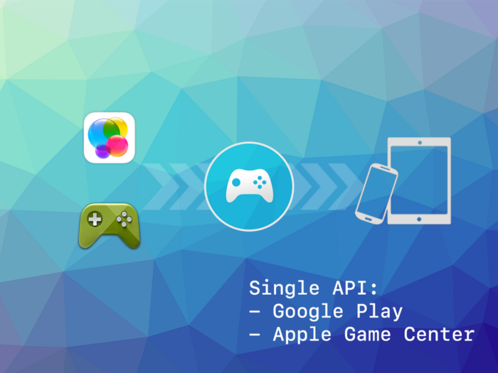

> June Release Update

June focused on Windows functionality improvements in NativeWebView and maintenance updates to GameServices packaging and documentation.

Key focus:

- NativeWebView Windows updates for cookie handling and cache clearing
- NativeWebView Chromium runtime update to v147.0.10
- GameServices packaging update to remove ReplayKit inclusion from the norecording workflow

<!-- truncate -->

Here's a quick overview of the latest extension updates:

:::note Extension Updates
- [NativeWebView v9.0.1](https://github.com/airnativeextensions/ANE-NativeWebView/releases/tag/v9.0.1) - Windows implementation updates, including improved cookie clearing, cache clearing, and Chromium version update
- [GameServices v11.0.3](https://github.com/airnativeextensions/ANE-GameServices/releases/tag/v11.0.3) - norecording packaging update and documentation cleanup
:::

If you have any questions, we're here to help!

---

### [NativeWebView](https://airnativeextensions.com/extension/com.distriqt.NativeWebView)

[v9.0.1](https://github.com/airnativeextensions/ANE-NativeWebView/releases/tag/v9.0.1)

This release updates the Windows implementation with better cache and cookie management and includes a Chromium runtime update.

#### Updates
- Windows: Improved remove-all-cookies functionality to better handle each WebView request context
- Windows: Added clear cache functionality
- Windows: Updated Chromium version to v147.0.10

---

### [GameServices](https://airnativeextensions.com/extension/com.distriqt.GameServices)

[v11.0.3](https://github.com/airnativeextensions/ANE-GameServices/releases/tag/v11.0.3)

Maintenance update improving norecording packaging behavior and cleaning up outdated documentation references.

#### Updates
- norecording: Updated implementation to remove ReplayKit inclusion and release airpackage
- Documentation: Removed references to legacy dependency com.distriqt.playservices.Drive
- Android Library Versions:
  - `com.google.android.gms.play-services-games` v21.0.0

---

## Further Information

As always, thank you for your continued support of distriqt and the AIR developer community.
Your feedback and contributions help us keep these extensions up to date and running smoothly across platforms.

- For full documentation and setup guides, visit [docs.airnativeextensions.com](https://docs.airnativeextensions.com)
- Join the AIR community discussions and get support at [github](https://github.com/airsdk/Adobe-Runtime-Support/)
- Publicly available extensions at [airnativeextensions](https://github.com/airnativeextensions)
- [Support](https://github.com/sponsors/marchbold) my ongoing involvement in the community

Stay tuned for more updates next month!
