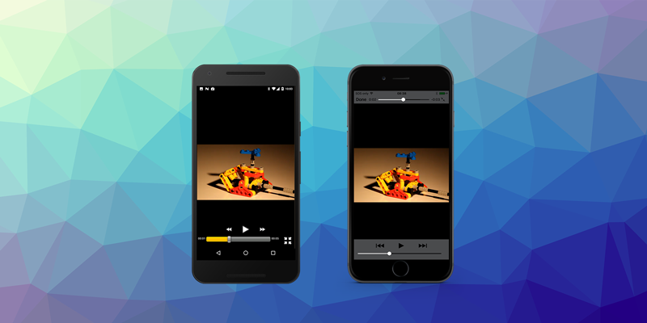

> July Release Update

July focused on iOS stability fixes across Firebase and MediaPlayer, along with Android runtime compatibility improvements for background thread execution.

Key focus:

- MediaPlayer updates for Android `runtimeInBackgroundThread` support and iOS crash fixes
- Firebase iOS core fixes delivered in two patch releases (v12.0.2 and v12.0.3)
- Ongoing platform reliability improvements for AIR projects targeting current OS versions

<!-- truncate -->

Here's a quick overview of the latest extension updates:

:::note Extension Updates
- [MediaPlayer v6.0.3](https://github.com/airnativeextensions/ANE-MediaPlayer/releases/tag/v6.0.3) - Android background thread support, iOS logging improvements, and iOS 26 crash fix
- [Firebase v12.0.3](https://github.com/airnativeextensions/ANE-Firebase/releases/tag/v12.0.3) - iOS core fix for missing `setDefaultEventParameters` function call
- [Firebase v12.0.2](https://github.com/airnativeextensions/ANE-Firebase/releases/tag/v12.0.2) - iOS core callback and missing function call fixes
:::

If you have any questions, we're here to help!

---

### [MediaPlayer](https://airnativeextensions.com/extension/com.distriqt.MediaPlayer)

[v6.0.3](https://github.com/airnativeextensions/ANE-MediaPlayer/releases/tag/v6.0.3)

This release improves Android audio player compatibility when running AIR in a background thread, and delivers iOS stability updates including a crash fix for iOS 26.

#### Updates
- Android: Added support for `runtimeInBackgroundThread` operation for audio players
- iOS: Implemented new logging methods for recent iOS implementation changes
- iOS: Fixed bad parameter crash on iOS 26
- Android Library Versions:
  - `androidx.media3` v1.8.0

---

### [Firebase](https://airnativeextensions.com/extension/com.distriqt.Firebase)

[v12.0.3](https://github.com/airnativeextensions/ANE-Firebase/releases/tag/v12.0.3)

Patch release focused on iOS core correctness, fixing a missing function call for default event parameters.

#### Updates
- iOS Core: Corrected missing `setDefaultEventParameters` function call

#### Included extension versions in v12.0.3
- `com.distriqt.firebase.Auth` v12.0.3 (Android 24.0.1, iOS 12.9.0)
- `com.distriqt.Firebase` v12.0.3 (Android 23.0.0, iOS 12.9.0)
- `com.distriqt.firebase.Crashlytics` v12.0.3 (Android 19.0.0, iOS 12.9.0)
- `com.distriqt.firebase.Database` v12.0.3 (Android 22.0.0, iOS 12.9.0)
- `com.distriqt.firebase.Firestore` v12.0.3 (Android 25.0.0, iOS 12.9.0)
- `com.distriqt.firebase.Performance` v12.0.3 (Android 22.0.0, iOS 12.9.0)
- `com.distriqt.firebase.RemoteConfig` v12.0.3 (Android 23.0.0, iOS 12.9.0)
- `com.distriqt.firebase.Storage` v12.0.3 (Android 22.0.0, iOS 12.9.0)

#### Previous patch in July
- [v12.0.2](https://github.com/airnativeextensions/ANE-Firebase/releases/tag/v12.0.2): iOS core callback operation and missing function call fixes

---

## Further Information

As always, thank you for your continued support of distriqt and the AIR developer community.
Your feedback and contributions help us keep these extensions up to date and running smoothly across platforms.

- For full documentation and setup guides, visit [docs.airnativeextensions.com](https://docs.airnativeextensions.com)
- Join the AIR community discussions and get support at [github](https://github.com/airsdk/Adobe-Runtime-Support/)
- Publicly available extensions at [airnativeextensions](https://github.com/airnativeextensions)
- [Support](https://github.com/sponsors/marchbold) my ongoing involvement in the community

Stay tuned for more updates next month!
