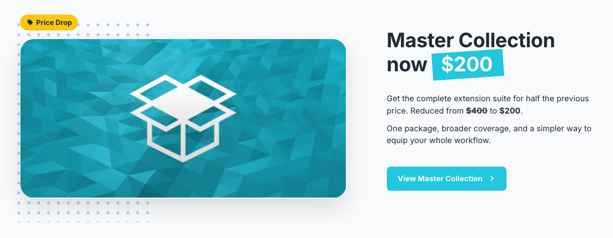

import Button from '@site/src/components/Button';

## More AIR tools. Less to budget for.

We're incredibly excited to announce a major price reduction designed to make our tools more accessible and support the growth of the community. 
We have repriced our packages to give more developers easy access to our extensions.

Our Master Collection package, which gives you access to all of the extensions available through our service, will now be available for **just USD $200**! 
That's a reduction of USD $200 from the previous price.
And the Game Development Tools and Monetisation packages will be reduced to USD $150. 

This makes our packages more affordable than ever, and gives you access to many more of our current and future extensions for a single price.

{/* truncate */}

:::note Access to all our extensions for a single price

<Button label="Upgrade to the Master Collection" link="https://airnativeextensions.com/package/1" size="lg" block={true} style={{ margin: '15px auto', textDecoration: 'none' }}/>

*An all-inclusive license giving you access to all our current and future native extensions. Now even better value with a greatly reduced price!*
:::

Or [view the available packages](https://airnativeextensions.com/package) to choose a smaller collection that fits your workflow.

### Existing subscribers

If you are already subscribed to one of the above packages through our new payment provider, the reduced price will be applied automatically at your next renewal.

If you have existing subscriptions to individual extensions, you can now upgrade to a package at any time. 
This will give you access to all of our extensions for a low price, and the remaining balance of your existing subscriptions will be applied as a credit towards the upgrade.

:::caution Migrating to the new payment provider    
If you have not moved to the new payment provider yet, now is a good time to do so. Follow the migration steps in your [subscription management page](https://airnativeextensions.com/user/licenses).
The price reduction will only be applied to subscriptions through the new payment provider.
:::

### Why lower the price?

Because we believe in the future of AIR and in the developers who continue to push it forward. By lowering prices we are aiming to:

- Lower the barrier to entry for new developers
- Provide a clear, affordable path for teams maintaining existing AIR projects
- Encourage experimentation and innovation across the whole ecosystem
- Help the AIR community continue to grow, thrive, and attract new talent

This update is more than a pricing change, it's our investment in the long-term health and vitality of the AIR community.

And importantly we just want to say thank you. Your support and dedication keep this platform alive, evolving, and full of possibility.

**Here's to the next chapter of AIR development: broader, more capable, and more accessible.**

