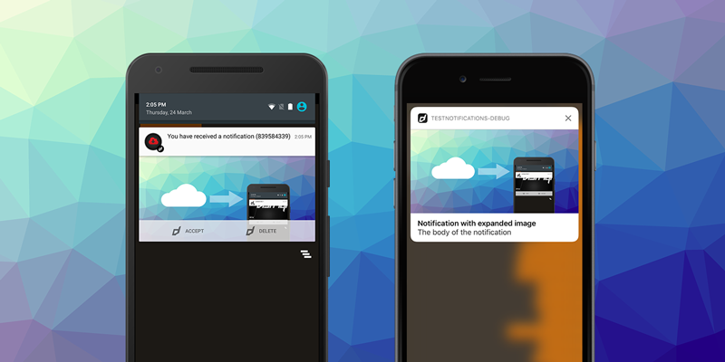
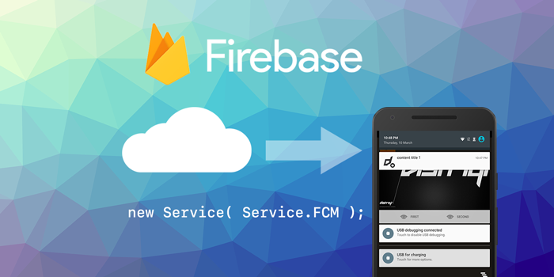
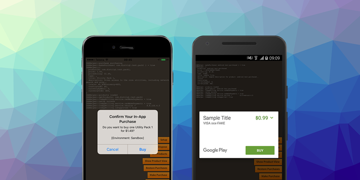
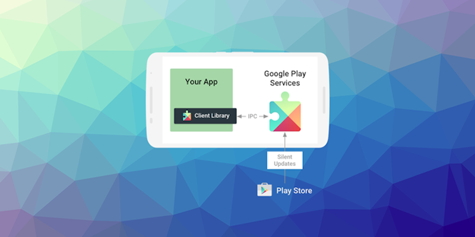

> Expanding local notifications to macOS and Linux, optimizing push notifications, and updating core Firebase and Google Play Services integrations.

September 2026 brought major updates across our notifications suite, highlighted by desktop support for local notifications on macOS and Linux. Alongside this expansion, we have deployed critical SDK updates to Firebase and Google Play Services, ensuring compliance and robust platform compatibility. This round of updates also optimises background image loading mechanisms to decrease runtime memory footprints on mobile platforms.

Key focus:
- **Desktop Notifications**: Local notifications are now fully supported on macOS and Linux.
- **Amazon Device Messaging**: Added native Amazon ADM integration for Push Notifications.
- **SDK Maintenance**: Aligned Firebase (BOM v34.19.0) and iOS Firebase (v12.19.1) across the suite.
- **Memory Optimisations**: Enhanced memory usage on Android when loading rich notification images.

:::note Extension Updates
- [Notifications v9.0.4](https://github.com/airnativeextensions/ANE-Notifications/releases/tag/v9.0.4) - Added macOS and Linux support, optimised Android image loading, and lock screen visibility settings.
- [PushNotifications v17.2.0](https://github.com/airnativeextensions/ANE-PushNotifications/releases/tag/v17.2.0) - Introduced Amazon Device Messaging support and aligned Firebase SDK to Android BOM v34.19.0 / iOS v12.19.1.
- [InAppBilling v18.1.3](https://github.com/airnativeextensions/ANE-InAppBilling/releases/tag/v18.1.3) - Clarified Target SDK documentation to prevent development ambiguities.
- [GooglePlayServices v32.3.0](https://github.com/airnativeextensions/ANE-GooglePlayServices/releases/tag/v32.3.0) - Updated Firebase/Play Services dependencies and added iOS Simulator Swift compatibility.
- [GoogleIdentity v8.2.0](https://github.com/airnativeextensions/ANE-GoogleIdentity/releases/tag/v8.2.0) - Updated Android GoogleID and iOS Sign-In SDKs.
- [Firebase v12.1.0](https://github.com/airnativeextensions/ANE-Firebase/releases/tag/v12.1.0) - Synchronised Android BOM and iOS dependencies, adding Remote Config custom signals support.
:::

<!-- truncate -->

## Extension Updates

---

### Notifications
- GitHub Releases: [v9.0.1](https://github.com/airnativeextensions/ANE-Notifications/releases/tag/v9.0.1), [v9.0.2](https://github.com/airnativeextensions/ANE-Notifications/releases/tag/v9.0.2), [v9.0.3](https://github.com/airnativeextensions/ANE-Notifications/releases/tag/v9.0.3), [v9.0.4](https://github.com/airnativeextensions/ANE-Notifications/releases/tag/v9.0.4)
- [Documentation](https://docs.airnativeextensions.com/docs/notifications/)

This major version expansion brings local notifications to macOS and Linux (x86_64 & arm64) while significantly refining Android's runtime memory usage and adding scheduling options.

#### Updates
- **macOS & Linux Support:** Added full macOS native notification center support and a streamlined `libnotify` implementation for Linux environments.
- **Android Memory Optimisation:** Removed legacy `AsyncTask` usage and optimised image downloading to resolve background memory issues.
- **Lock Screen Visibility:** Added the capability to toggle visibility (private/public) on the Android lock screen.
- **Exact Alarms:** Introduced reliable Android exact alarm scheduling to address issues on newer Target SDKs.
- **Bug Fixes:** Resolved UTF-8 character handling on Windows and added large icon support for Linux.

---

### PushNotifications
- GitHub Releases: [v17.1.0](https://github.com/airnativeextensions/ANE-PushNotifications/releases/tag/v17.1.0), [v17.2.0](https://github.com/airnativeextensions/ANE-PushNotifications/releases/tag/v17.2.0)
- [Documentation](https://docs.airnativeextensions.com/docs/pushnotifications/)

This update introduces support for Amazon Device Messaging (ADM) and optimises background performance during asset loading alongside updates to the latest underlying Firebase SDKs.

#### Updates
- **Amazon Device Messaging (ADM):** Native support for ADM alongside a dedicated `OneSignalAmazon` package for simple integration via `apm`.
- **Optimised Background Loading:** Enhanced image memory usage on Android to prevent system overhead limits during notification payloads.
- **Firebase Alignment:** Upgraded Android Firebase FCM SDK components to BOM v34.19.0 and iOS counterparts to v12.19.1.

---

### InAppBilling
- GitHub Release: [v18.1.3](https://github.com/airnativeextensions/ANE-InAppBilling/releases/tag/v18.1.3)
- [Documentation](https://docs.airnativeextensions.com/docs/inappbilling/)

A clean documentation alignment release updating Target SDK references.

#### Updates
- **Clarified Guidelines:** Removed target SDK definitions within the documentation to simplify setup and lower deployment confusion.

---

### GooglePlayServices
- GitHub Release: [v32.3.0](https://github.com/airnativeextensions/ANE-GooglePlayServices/releases/tag/v32.3.0)
- [Documentation](https://github.com/airnativeextensions/ANE-GooglePlayServices/wiki/)

A major maintenance release aligning core Play Services dependencies to Android BOM v34.19.0 and iOS v12.19.1.

#### Updates
- **Firebase SDK Sync:** Updated multiple packages (Core, Messaging, AdIdSupport, OnDeviceConversion) to Bom v34.19.0 (Android) and v12.19.1 (iOS).
- **iOS Simulator Swift Support:** Added native support for Swift compatibility libraries within iOS Simulators.
- **Auth Upgrades:** Bumped Google Play Services Auth dependency to v22.0.0.

---

### GoogleIdentity
- GitHub Release: [v8.2.0](https://github.com/airnativeextensions/ANE-GoogleIdentity/releases/tag/v8.2.0)
- [Documentation](https://docs.airnativeextensions.com/docs/googleidentity/)

Essential security and compatibility updates for Google Sign-In and GoogleID libraries on Android and iOS.

#### Updates
- **Android Upgrades:** Updated Android GoogleID SDK to v1.2.1, bringing Auth to v22.0.0 and Credentials to v1.6.0.
- **iOS Upgrades:** Updated iOS Google Sign-In SDK to v9.2.0.

---

### Firebase
- GitHub Release: [v12.1.0](https://github.com/airnativeextensions/ANE-Firebase/releases/tag/v12.1.0)
- [Documentation](https://docs.airnativeextensions.com/docs/firebase/)

Core Firebase modules have been fully updated to the latest upstream SDKs, adding Swift compatibility enhancements and Remote Config improvements.

#### Updates
- **BOM Sync:** Upgraded Firebase Android SDK to BOM v34.19.0 and iOS Firebase to v12.19.1.
- **Swift Compat:** Added iOS Simulator Swift compatibility libraries.
- **Remote Config Custom Signals:** Introduced support for custom signals within the Remote Config library.

---

## Further Information

As always, thank you for your continued support of distriqt and the AIR developer community. Your feedback and contributions help us keep these extensions up to date and running smoothly across platforms.

- For full documentation and setup guides, visit [docs.airnativeextensions.com](https://docs.airnativeextensions.com)
- Join the AIR community discussions and get support at [github](https://github.com/airsdk/Adobe-Runtime-Support/)
- Publicly available extensions at [airnativeextensions](https://github.com/airnativeextensions)
- [Support](https://github.com/sponsors/marchbold) my ongoing involvement in the community

Stay tuned for more updates next month!